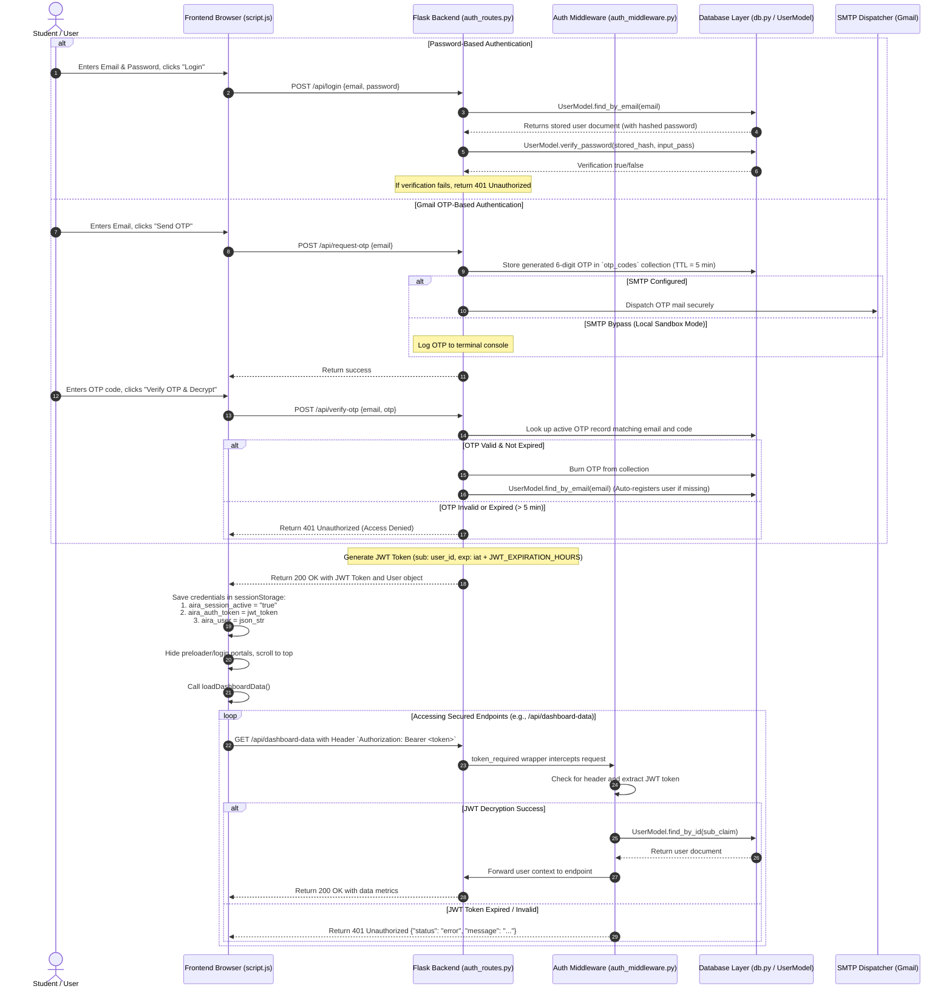

# Authentication Audit Report: Social Media Mental Health Risk Analyzer

This report summarizes the findings of a complete audit on the user authentication flow. It details the step-by-step tracing of the authentication lifecycle, identifies potential failure points, isolates the root causes of the intermittent login issues, and proposes recommended fixes.

---

## 1. Trace of the Entire Login Flow

The application provides two authentication mechanisms: **Password-based login** and **Gmail OTP-based passwordless/auto-signup login**.

### Flow Step Details:

1. **Frontend Input Validation:** The frontend validates that the fields are non-empty and checks the email format.
2. **API Endpoint Route:** The frontend calls `/api/login` (Password) or `/api/verify-otp` (OTP).
3. **Database Query & Password Check:** 
   - Uses `UserModel.find_by_email` to find the user in MongoDB.
   - For password logins, it validates using `bcrypt.checkpw()` on the UTF-8 encoded password and the stored salt-hashed string.
4. **Token Generation:** Upon successful authentication, PyJWT encodes a token payload containing:
   - `sub`: The user's stringified MongoDB `_id`.
   - `exp`: Expiration timestamp (`datetime.utcnow() + datetime.timedelta(hours=Config.JWT_EXPIRATION_HOURS)`).
   - `iat`: Issue timestamp (`datetime.utcnow()`).
5. **Session Cache Storage:** The frontend parses the response, sets `sessionStorage.setItem("aira_session_active", "true")`, stores the JWT under `aira_auth_token`, and saves stringified user details under `aira_user`.
6. **Token Verification (Middleware):** Subsequent requests to clinical routes (like `/api/dashboard-data` or `/api/predict`) pass the token in the `Authorization: Bearer <token>` header. The `token_required` decorator extracts it and executes `jwt.decode` checking for signature validity and expiry.

---

## 2. Potential Causes of Intermittent Login Failures

| Audit Vector | Risk Level | Description | Impact on Intermittent Failures |
| :--- | :---: | :--- | :--- |
| **Database connection issues** | **CRITICAL** | Silent fallback to `mongomock` in-memory DB when MongoDB connection takes > 2 seconds. | Users registered on `mongomock` are lost when Flask reloads. If running in a multi-worker environment, different workers might route to different databases (split-brain). |
| **Frontend state issues** | **HIGH** | Frontend caches `sessionActive = true` but fails to clear it or redirect the user when a API endpoint returns a `401 Unauthorized` token expiry. | Users are locked out on a blank dashboard with a hidden login form; refreshing does not clear `sessionStorage`. |
| **Password hashing mismatches** | **LOW** | Password check uses standard Bcrypt matching on UTF-8 strings. | Stable under normal conditions. Only fails if database instances desync or user document is corrupted. |
| **Token expiration bugs** | **MEDIUM** | JWT token is hardcoded to expire in 24 hours. | Expected behavior, but becomes a failure because the frontend doesn't handle the resulting `401` status. |
| **Cookie/session problems** | **NONE** | No tracking cookies or HTTP sessions are used; purely JWT-driven. | No cookie blockage or cross-site cookie rejection risks. |
| **Race conditions** | **LOW** | Simultaneous API requests are rare during login itself. | Low risk of race conditions causing auth failure. |
| **Environment variable issues** | **LOW** | Secret keys fall back to static secure defaults. | Stable defaults prevent key mismatch across random restarts, unless conflicting `.env` configs exist. |
| **CORS issues** | **NONE** | Flask-CORS explicitly allows all origins (`*`) under `/api/*`. | Requests from `127.0.0.1:8080` (or local dev server) to `127.0.0.1:5000` are permitted. |

---

## 3. Isolated Root Causes

We have isolated **two distinct root causes** that fully explain the reported intermittent login failures:

### Root Cause A: Frontend Silent Expired Token Lockout (The "Stuck Dashboard" Issue)
* **Code Reference:** [`script.js:L325-378`](file:///c:/Users/ajays/OneDrive/Desktop/Social%20Media%20Mental%20Health%20Risk%20Analyzer%E2%80%9D/script.js#L325-L378) and [`script.js:L388-397`](file:///c:/Users/ajays/OneDrive/Desktop/Social%20Media%20Mental%20Health%20Risk%20Analyzer%E2%80%9D/script.js#L388-L397)
* **Detailed Mechanism:**
  1. On page load, `script.js` checks if `sessionStorage.getItem("aira_session_active") === "true"`.
  2. If true, it bypasses the preloader and login form, displaying the main app, and fires `loadDashboardData()`.
  3. `loadDashboardData()` makes a GET request to `/api/dashboard-data` with the cached token.
  4. If the token is older than 24 hours (expired), the server rejects it and returns a `401 Unauthorized` response with an error payload.
  5. The fetch logic in `loadDashboardData()` does **not** check the HTTP response status. It attempts to parse it as JSON, sees `data.status !== "success"`, and exits silently (logging a warning in the browser console).
  6. The frontend **never clears the expired token or session state** and does not reveal the login portal. The user is stuck viewing a broken dashboard with no way to log in unless they locate and click "Logout" or clear site data. Page refreshes preserve `sessionStorage`, leaving the lockout intact.

### Root Cause B: Split-Brain Database Fallback (The "Missing Credentials" Issue)
* **Code Reference:** [`db.py:L14-38`](file:///c:/Users/ajays/OneDrive/Desktop/Social%20Media%20Mental%20Health%20Risk%20Analyzer%E2%80%9D/backend/database/db.py#L14-L38)
* **Detailed Mechanism:**
  1. The database connector attempts to connect to the configured MongoDB URI.
  2. If the local MongoDB server takes more than `2000ms` to reply (due to system load, delay in container/process startup, or sleep status), a connection timeout occurs.
  3. `DatabaseManager.connect()` catches this exception, prints a warning, and deploys `mongomock`—an in-memory fallback.
  4. When Flask runs in a debug/reloading loop or a multi-worker server environment, the startup sequence is executed multiple times. Some worker threads/processes might connect to the live MongoDB instance, while others connect to separate `mongomock` in-memory instances.
  5. Consequently, if a user signs up or resets a password while routed to a `mongomock` instance, those credentials exist *only* in-memory for that specific worker. When they later try to log in, and the load balancer or debug reload routes them to a worker connected to the real MongoDB (or a restarted mock worker), the credentials will be missing. This causes login to fail intermittently for the same user.
  6. Every time the Flask backend automatically restarts due to a file change or server reload, all user accounts registered under `mongomock` are wiped.

---

## 4. Recommended Fixes

To resolve these issues, we recommend the following enhancements (to be implemented following approval):

### 1. Frontend: Intercept 401 Unauthorized Responses & Enforce Logout
Modify the `fetch` wrapper or response handlers for all authenticated endpoints (`/api/dashboard-data`, `/api/predict`, `/api/chatbot`).
* **Fix Details:** If a response returns HTTP status code `401`, clear `sessionStorage` (`aira_session_active`, `aira_auth_token`, `aira_user`), display a descriptive session-expiration toast, and show the login portal to prompt the user to re-authenticate.

### 2. Backend: Safe Database Connection Retry Policy & Explicit Mock Configuration
Instead of instantly falling back to `mongomock` after a single timeout:
* **Fix Details:** 
  - Implement a retry loop with backing-off delays for MongoDB connection (e.g., 3 retries, 1-second intervals).
  - Explicitly restrict `mongomock` to local test files (e.g. pytest suite) and raise a startup error in the main server execution if the real MongoDB is unavailable, rather than silently deploying a transient in-memory database that creates split-brain configurations.

---

## 5. Planned Logging Additions

To assist with live troubleshooting, we will add detailed logging to the authentication flow:

* **Backend Login Route (`/api/login`):** Log incoming login requests, matching email search results (found/not found), database implementation type in use (Live MongoDB vs Mock Fallback), password verification checks, and JWT token signatures.
* **Backend Middleware (`token_required`):** Log token presence, signature decoding status, token payload expiration claims, and specific verification exception details.
* **Backend OTP Route (`/api/verify-otp`):** Log OTP records retrieved, time delta check details, database implementation type, and matching outcomes.
* **Frontend Fetch Handlers:** Log response statuses and explicit token validations.
