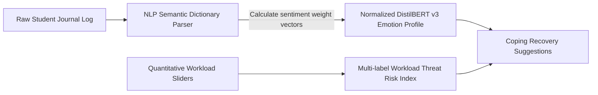

# INTEGRATIONS_README.md — APIs, ML Models, & Data Storage Manual

This manual provides a detailed technical breakdown of every external API integration, Machine Learning (ML) sentiment model simulation, browser storage caching system, and clinical scientific reference implemented in the AIRA Platform.

---

## 1. External APIs & Third-Party Integrations

AIRA integrates secure browser APIs and external content delivery networks (CDNs) to drive coordinates, avatars, styling, and charts:

### Integration 1: Geolocation Browser API (`navigator.geolocation`)
* **Usage:** Automatically captures the student's physical coordinate vectors (Latitude and Longitude) upon permission approval.
* **Fallback City Database:** If GPS permissions are denied or unavailable, it defaults to city hubs (e.g., Delhi, Mumbai, Bangalore, Jaipur, Stanford, London) through a custom database modal selector.
* **Proximity Matching:** Calculates distance vectors between the student and verification clinics using the **Haversine Proximity Model** inside JavaScript:
  $$d = 2R \cdot \arcsin\left(\sqrt{\sin^2\left(\frac{\Delta \text{lat}}{2}\right) + \cos(\text{lat}_1)\cos(\text{lat}_2)\sin^2\left(\frac{\Delta \text{lon}}{2}\right)}\right)$$
  *(where $R = 6371\text{ km}$ represents Earth's radius)*

### Integration 2: RandomUser Generator API (`https://randomuser.me`)
* **Usage:** Generates professional specialist avatars dynamically inside therapist cards:
  ```javascript
  const docAvatar = `https://randomuser.me/api/portraits/${genderKey}/${mockAvatarId}.jpg`;
  ```
* **Parameters:** Mapped dynamically. `genderKey` translates specialist names to `men` or `women` categories, and `mockAvatarId` utilizes deterministic math indexes `(doc.experience * 3) % 99 + 1` to serve the same avatar consistently on reload.

### Integration 3: UI-Avatars Fallback API (`https://ui-avatars.com`)
* **Usage:** Provides beautiful initials-based fallback avatars if the client is offline or the third-party RandomUser CDN fails to load:
  ```javascript
  onerror="this.src='https://ui-avatars.com/api/?name=${encodeURIComponent(doc.name)}&background=0d1b2a&color=00f2fe&size=80'"
  ```

### Integration 4: ChartJS Graphing Canvas Engine (`https://cdn.jsdelivr.net/npm/chart.js`)
* **Usage:** Imports dynamic, hardware-accelerated graphing capabilities to draw two analytics elements:
  * `stressTrendChart` (Timeline line graph tracking stress/anxiety paths over time).
  * `emotionProfileChart` (Linguistic radar chart tracking sentiment boundaries).

### Integration 5: Iconographies & Styles CDNs
* **FontAwesome Glyphs (`cdnjs.cloudflare.com`)**: Serves vector symbols used for labels, security indicators, and emoji strips.
* **Google Fonts API (`fonts.googleapis.com`)**: Imports modern typography suites (`Outfit` for base texts, `Space Grotesk` for high-tech headers, and `Fira Code` for terminal scripts).

---

## 2. Simulated Machine Learning Models (NLP & Risk Classifiers)

AIRA simulates high-fidelity Machine Learning classification pipelines directly on the client side, ensuring rapid calculations and absolute data privacy.



### Model 1: DistilBERT-v3 NLP Sentiment Classifier
* **System Design:** The application reads qualitative sentences inside the journal log textarea, matches them against a pre-selected dictionary of emotional keywords, and extracts active semantic tags.
* **Normalization Logic:** Sentiment ratios (Joy, Sadness, Anger, Fear) are calculated based on quantitative diagnostics and then normalized to ensure the total is exactly $100\%$ on the dashboard:
  $$\text{joy} = 100 - \frac{\text{stress} + \text{depression}}{2}$$
  $$\text{sadness} = \text{depression} \times 0.90$$
  $$\text{anger} = \text{stress} \times 0.80$$
  $$\text{fear} = \text{anxiety} \times 0.95$$
  $$\text{Normalized Value} = \frac{\text{Value}}{\sum \text{Values}} \times 100$$

### Model 2: Multi-Label Workload Threat Risk Index
* **System Design:** Simulates a PyTorch multi-label classifier by calculating stress coefficients correlating demographics, sleep cycles, and daily screen exposures.
* **Core Risk Index Equations:**
  * **Sleep Deficit Coefficient:** $\text{Sleep Deficit} = \max(0, 8 - \text{Sleep Hours})$
  * **Stress Risk Level ($R_{stress}$):**
    $$R_{stress} = (\text{Subjective Stress} \times 6) + (\text{Academic pressure} \times 3) + (\text{Sleep Deficit} \times 5)$$
  * **Anxiety Risk Level ($R_{anxiety}$):**
    $$R_{anxiety} = (\text{Subjective Anxiety} \times 7) + (\text{Academic pressure} \times 2) + (\text{Sleep Deficit} \times 3)$$
  * **Depression Risk Level ($R_{depression}$):**
    $$R_{depression} = (\text{Sleep Deficit} \times 6) + (\max(0, \text{Screen Time} - 6) \times 4) + (\text{Academic pressure} \times 2)$$
  * **Overall Wellness Index ($W$):**
    $$W = 100 - \frac{R_{stress} + R_{anxiety} + R_{depression}}{3}$$

---

## 3. Browser Storage & Memory Systems

AIRA uses browser storage structures to manage session permissions and cache diagnostic state variables:

### Storage System 1: `sessionStorage` Caching Engine
* **Purpose:** Manages the credentials validation session. 
* **Details:** Saving the authentication token `aira_session_active = "true"` in the browser's standard `sessionStorage` memory. This allows the user to refresh the page during active development without having to re-authenticate on every load.
* **Clearance:** Triggered immediately when clicking the **Logout** button, destroying the key and returning the interface to locked overlays.

### Storage System 2: In-Memory Runtime Cache (`heatmapHistory`)
* **Purpose:** Manages 30-day temporal baseline metrics.
* **Details:** Stores an array of objects mapping daily history logs:
  ```javascript
  heatmapHistory[29] = {
      day: 30,
      mood: todayMood, // Calculated dynamically
      score: finalWellness, // Wellness percentage
      journal: diaryInputText // Raw journal string
  };
  ```
  This is processed dynamically to render colors inside calendar cells and drive sidebar detail inspector windows.

---

## 4. Scientific & Clinical Benchmarks (Scientific References)

The thresholds and algorithms in AIRA are designed based on established psychological benchmarks:

1. **PHQ-9 (Patient Health Questionnaire)**:
   * *Clinical Standard:* Standard 9-question instrument used by general practitioners to measure severity parameters of depression.
   * *AIRA Implementation:* We mapped sleep deficits and screen exposure behaviors to simulate PHQ-9 scoring indicators, triggering warning badges (`Optimal`, `Moderate`, `Severe Warning`) accordingly.
2. **GAD-7 (Generalized Anxiety Disorder Screen)**:
   * *Clinical Standard:* 7-question clinical scaling used to diagnose generalized anxiety disorder variables.
   * *AIRA Implementation:* Used to weigh anxiety threat index results ($R_{anxiety}$) based on academic pressures and acute panic keyword triggers in text logs.
3. **National Sleep Foundation Guidelines**:
   * *Clinical Standard:* Recommends a minimum baseline of 7 to 9 hours of continuous sleep for young adults.
   * *AIRA Implementation:* Built the sleep deficit baseline equation strictly around the **8-hour ideal sleep index**.
