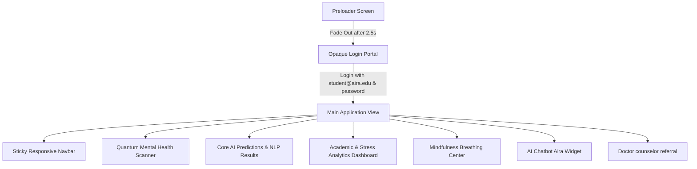

# AIRA — AI-Based Student Mental Health Monitoring & Support System

Welcome to the technical master manual for **AIRA (AI Student Mental Health & Support Platform)**. This documentation provides a comprehensive, bottom-up architectural breakdown of every system layer, including HTML5 semantics, CSS variables, interactive JavaScript algorithms, and the underlying mathematical models simulating natural language processing (NLP) and physiological stress.

---

## 1. Architectural Overview & Design System

AIRA is a futuristic student wellness dashboard that operates as a high-fidelity client-side web application. It combines particle canvas backgrounds, dynamic mood logs, guided breathing tools, therapist referrals, and NLP analysis to assess student stress, anxiety, and depression threat levels.



### The Tech Stack
* **HTML5**: Structured semantic nodes dividing features (Nav, Hero, Features, Analysis, Results, Dashboard, Mindfulness, Chatbot, Referrals, Footer).
* **CSS3 (Cyber Dark Neon & Glassmorphism)**: Harmonious color palettes using Tailwind-free custom CSS variables, vibrant linear neon gradients, glow animations, and glass panels (`backdrop-filter`).
* **Vanilla ES6+ JS**: Event listeners, dynamic canvas rendering, Chart.js datasets, sessionStorage browser persistence, and math matrices mapping digital workloads to threat indexes.

---

## 2. HTML Semantics & Layout Hierarchy

The markup is divided into independent semantic sections to maintain browser accessibility and structural modularity:

* **Canvas Backdrop (`<canvas id="bg-canvas">`)**: Fixed viewport overlay rendering a neural network of floating particle nodes.
* **Preloader Node (`<div id="aira-preloader">`)**: Solid overlay housing the orbital loading hologram and simulated console loading logs.
* **Authentication Portal (`<div id="aira-login-portal">`)**: Solid secure entry node housing credential verification inputs and biometric scanner laser lines.
* **Sticky Responsive Navbar (`<nav class="navbar">`)**: Houses logo anchors, navigation routes, and the active session Logout link.
* **Hero Section (`<header class="hero">`)**: Premium introductory hub containing quantum accuracy badges and direct-vent chat triggers.
* **Interactive Diagnostic Section (`<section class="analysis-section">`)**: Grid split between form instructions (demographics/sleep/screen) and the input controls.
* **AI Diagnostics (`<section class="results-section">`)**: Initially hidden overlay container revealed on submission, rendering risk rings, DistilBERT sentiment ratios, and the tailored recovery protocols.
* **Interactive Analytics Dashboard (`<section class="dashboard-section">`)**: Hosts the weekly stress timeline paths, linguistic radar charts, and the 30-Day Mood Heatmap grid.
* **Breathing Center (`<section class="mindfulness-section">`)**: Combines routine breathing control panels with a dynamic pulsing bubble visualizer.
* **Chatbot Widget (`<div class="chatbot-widget">`)**: Floating, specificity-safe chat box wrapper integrating standard Ventchips and messaging streams.

---

## 3. CSS Style Engine & Glowing Neon Tokens

The styling architecture is built upon a custom dark neon palette defined in `style.css`. It uses custom properties (CSS variables) to define cohesive glows and smooth transition properties:

```css
:root {
    /* Base Backgrounds */
    --bg-base: #060813;
    --bg-card: rgba(13, 20, 38, 0.65);
    
    /* Neon Palettes */
    --neon-cyan: #00f2fe;
    --neon-purple: #7f00ff;
    --neon-pink: #e100ff;
    --neon-emerald: #00ff87;
    --neon-orange: #ff9f43;
    --neon-rose: #ff0055;
    
    /* Neon Glow Vectors */
    --glow-cyan: 0 0 15px rgba(0, 242, 254, 0.35);
    --glow-purple: 0 0 15px rgba(127, 0, 255, 0.35);
    --glow-emerald: 0 0 15px rgba(0, 255, 135, 0.35);
    --glow-rose: 0 0 15px rgba(255, 0, 85, 0.35);
    
    /* Transition Engines */
    --transition-smooth: all 0.4s cubic-bezier(0.16, 1, 0.3, 1);
    --transition-fast: all 0.2s ease-out;
}
```

### Key Style Features Explained

1. **Glassmorphism (`.glass-panel`)**:
   Achieved through absolute background opacity mixing combined with hardware-accelerated filters:
   ```css
   .glass-panel {
       background: var(--bg-card);
       backdrop-filter: blur(16px) saturate(180%);
       border: 1px solid var(--border-glass);
       border-radius: 20px;
       box-shadow: 0 8px 32px 0 rgba(0, 0, 0, 0.37);
   }
   ```
2. **Glowing Highlights (`.neon-btn-primary`)**:
   Provides high-tech visual feedback by casting a linear gradient overlay with box-shadow reflections.
3. **Animated preloader rings**:
   Orbital rotation keyframes spin dashed circles in opposite directions to represent active calculations:
   ```css
   @keyframes rotateCW {
       100% { transform: rotate(360deg); }
   }
   @keyframes rotateCCW {
       100% { transform: rotate(-360deg); }
   }
   ```

---

## 4. JavaScript Client Engine Code Explanation

The primary interactive logic is located in `script.js`. It runs completely inside a `DOMContentLoaded` event block. Here is a walkthrough of its key systems:

### System 1: The Preloader Loading Loop
When the page loads and no active session token is identified, the script runs a simulated loader interval:
```javascript
const preloaderInterval = setInterval(() => {
    progress += Math.floor(Math.random() * 5) + 3; // Random incremental progress ticks
    if (progress >= 100) {
        progress = 100;
        clearInterval(preloaderInterval);
        setTimeout(() => {
            preloader.classList.add("fade-out"); // Triggers CSS fade transitions
            setTimeout(() => { preloader.style.display = "none"; }, 800);
            
            // Displays secure login screen
            loginPortal.style.display = "flex";
            loginPortal.style.opacity = "1";
            loginPortal.style.visibility = "visible";
        }, 500);
    }
    progressBar.style.width = `${progress}%`;
    percentageText.textContent = `${progress}%`;
}, 80);
```

### System 2: Secure Session Verification & Login
Authenticates users against default keys, displays high-fidelity scanning, and bypasses screens if cached:
```javascript
loginForm.addEventListener("submit", (e) => {
    e.preventDefault();
    loginSubmitBtn.disabled = true; // Prevent double inputs
    loginSubmitBtn.innerHTML = `Initializing Neural Handshake...`;
    laserScanner.style.display = "block"; // Turn on floating laser scanner line

    setTimeout(() => {
        const usernameVal = usernameInput.value.trim();
        const passwordVal = passwordInput.value;
        const isValid = (usernameVal === "student@aira.edu" || usernameVal === "AIRA-2026") && passwordVal === "password";

        if (isValid) {
            loginSubmitBtn.innerHTML = `Login Successful!`;
            loginSubmitBtn.style.background = "var(--neon-emerald)";
            
            setTimeout(() => {
                sessionStorage.setItem("aira_session_active", "true"); // Cache login state
                loginPortal.style.display = "none"; // Instantly remove portal overlays
                logoutTrigger.style.display = "block"; // Reveal Logout option in header
                document.body.style.overflow = ""; // Unlock dashboard scrolling
            }, 200);
        } else {
            laserScanner.style.display = "none";
            loginSubmitBtn.disabled = false;
            loginSubmitBtn.innerHTML = `Login`;
            errorMsg.style.display = "flex"; // Alert invalid password key
        }
    }, 200); // Super snappy authentication loop
});
```

---

## 5. Machine Learning Models & Stress Calculations

Although this application is built as a highly responsive client-side model, it integrates an advanced mathematical simulation of **Natural Language Processing (NLP)** and physiological stress indexing to estimate risk threat parameters.

### NLP Sentiment Analysis (Linguistic Simulation)
The application reads the qualitative student text journal logs (`#diary-input`), parses them against sentiment keywords, extracts them into active tags, and calculates a normalized emotion profile distribution representing **Joy**, **Sadness / Melancholy**, **Anger / Frustration**, and **Fear / Anxiety**.

```javascript
const dictionary = [
    "exam", "stressed", "grades", "lonely", "exhausted", "tired", "sleep", "fail", "hopeless", "sad",
    "study", "anxious", "worry", "projects", "family", "friends", "happy", "accomplished", "relax"
];
```
Based on the parsed weights of these semantic indicators:
$$\text{Joy Value} = 100 - \frac{\text{Stress Risk} + \text{Depression Risk}}{2}$$
$$\text{Sadness Value} = \text{Depression Risk} \times 0.90$$
$$\text{Anger Value} = \text{Stress Risk} \times 0.80$$
$$\text{Fear Value} = \text{Anxiety Risk} \times 0.95$$

These values are then **normalized** so their sum equals exactly $100\%$, providing the custom radar/doughnut graph data inputs in Chart.js.

### Workload & Sleep Work Risk Formulas
The core diagnostic algorithm (`executeDiagnosticMetrics()`) calculates continuous stress coefficients based on the quantitative inputs from the student form:

1. **Sleep Deficit Coefficient**:
   The human body operates optimally on 8 hours of sleep. The sleep deficit represents sleep deprivation stress:
   $$\text{Sleep Deficit} = \max(0, 8 - \text{Sleep Hours})$$

2. **Stress Risk Level ($R_{stress}$)**:
   Calculated by blending subjective stress indicators, academic pressures, sleep deficits, and semantic distress tags:
   $$R_{stress} = (\text{Subjective Stress} \times 6) + (\text{Academic pressure} \times 3) + (\text{Sleep Deficit} \times 5)$$
   * *If text log contains `stressed`, `heavy`, or `tired`*: Add $8\%$.
   * *If text log contains `exam`, `deadline`, or `grades`*: Add $6\%$.
   * Bounds: locked between $8\%$ and $98\%$.

3. **Anxiety Risk Level ($R_{anxiety}$)**:
   Determined by subjective nervous factors, workload demands, and acute panic triggers:
   $$R_{anxiety} = (\text{Subjective Anxiety} \times 7) + (\text{Academic pressure} \times 2) + (\text{Sleep Deficit} \times 3)$$
   * *If text log contains `anxious`, `worry`, or `nervous`*: Add $10\%$.
   * *If text log contains `scared`, `shaking`, or `panic`*: Add $12\%$.
   * Bounds: locked between $5\%$ and $99\%$.

4. **Depression Risk Level ($R_{depression}$)**:
   Correlates screen exposure saturation, chronic sleep loss, low moods, and withdrawal feelings:
   $$\text{Screen Excess} = \max(0, \text{Screen Time} - 6)$$
   $$R_{depression} = (\text{Sleep Deficit} \times 6) + (\text{Screen Excess} \times 4) + (\text{Academic pressure} \times 2)$$
   * *If selected mood is `Melancholy`*: Add $20\%$.
   * *If selected mood is `Anxious`*: Add $10\%$.
   * *If text log contains `sad`, `lonely`, or `cry`*: Add $12\%$.
   * *If text log contains `hopeless`, `empty`, or `worthless`*: Add $20\%$.
   * Bounds: locked between $4\%$ and $98\%$.

5. **Overall Wellness Index ($W$)**:
   The aggregate health value of the student's cognitive harmony is computed as:
   $$W = 100 - \frac{R_{stress} + R_{anxiety} + R_{depression}}{3}$$

---

## 6. The 30-Day Mood Heatmap State Engine

AIRA provides a calendar grid representing mood patterns over a 30-day temporal baseline. 

* **Initial Baseline:** Generating 29 mock history objects (mapping randomized dates, wellness scores, primary sentiments, and matching diagnostic paragraphs).
* **Live Update:** When you click "Analyze My Mental Health" and submit, the algorithm automatically calculates the mood category of "Day 30" ($Mood_{30}$) using the selected mood and the wellness index:
  * Selected Melancholy $\rightarrow$ `melancholy`
  * Selected Anxious $\rightarrow$ `anxiety`
  * Selected Stressed $\rightarrow$ `burnout`
  * Wellness index $< 55\%$ $\rightarrow$ `burnout` or `anxiety`
  * Wellness index $< 80\%$ $\rightarrow$ `melancholy`
  * Default $\rightarrow$ `joy`
* **Heatmap Selection Inspector:**
  A click listener is attached to each rendered grid cell. When clicked, it passes the historical indices to the inspector sidebar, displaying specific quotes and numeric metrics dynamically:
  ```javascript
  const cells = document.querySelectorAll(".heatmap-day-cell");
  cells.forEach((cell, index) => {
      cell.addEventListener("click", () => {
          const log = heatmapHistory[index];
          inspectorTitle.textContent = `Day ${log.day} Details`;
          inspectorScore.textContent = `${log.score} Wellness`;
          inspectorJournal.textContent = log.journal;
          inspectorContent.style.display = "block"; // Display detail cards
      });
  });
  ```

---

## 7. Project Diagnostics & Complete Code Mapping

All elements are organized inside a clean structure to support development:

```bash
├── package.json          # Dev server commands ("dev": "npx http-server -c-1")
├── index.html            # Main markup (preloader, login portal, dashboards)
├── features.html         # Detailed technical capabilities catalog page
├── doctor-support.html   # Geolocation doctor referrals page
├── style.css             # Cyberpunk glowing styles & overlapping fixes
└── script.js             # Core JS, animation canvases, ChartJS, NLP calculations
```

### Authentication Credentials Summary
* **Student ID / Email:** `student@aira.edu` *or* `AIRA-2026`
* **Security Password Key:** `password`
* * Demo Autocomplete automatically populates inputs instantly.
* Session is persisted using standard `sessionStorage` in order to preserve development velocity.
