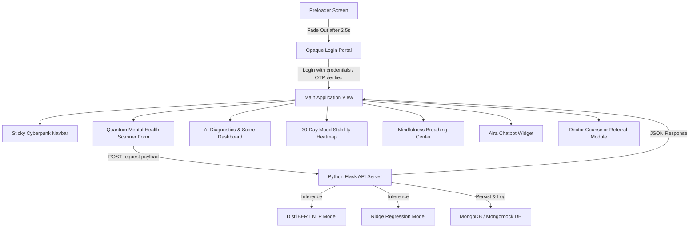

# AIRA — AI-Based Student Mental Health Monitoring & Support System
Welcome to the comprehensive technical documentation for **AIRA (AI Student Mental Health & Support Platform)**. This manual provides a bottom-up architectural breakdown of every system layer, detailing the frontend design system, the Python Flask backend microservices, the MongoDB database collections, and the integrated machine learning prediction models (Hugging Face Transformers & Ridge Regression).

---

## 1. Project Overview & Architectural Flow
AIRA is a high-fidelity mental health monitoring dashboard designed specifically for students. It combines real-time natural language processing (NLP), physiological metrics, interactive timeline visualizations, mindfulness tools, and an AI-driven chatbot assistant.

### System Workflow


---

## 2. Technology Stack Breakdown

### Frontend (Client Interface)
* **HTML5**: Semantically structured document (Nav, Hero, Analysis Form, Results, Analytics Dashboard, Mindfulness, Chatbot Widget, Referrals, Footer).
* **Vanilla CSS3 (Tailwind-Free Custom Styling)**: Engineered using a cyber dark neon palette, glassmorphism panel styles (`backdrop-filter`), hover scale micro-animations, and glowing neon box-shadow highlights.
* **Vanilla ES6+ JS**: Event delegation, session storage cache lifecycle, dynamic `#bg-canvas` network background rendering, interactive Chart.js graphs, and front-end validators.

### Backend (Server Node)
* **Language**: **Python 3.12**
* **Framework**: **Flask** (structured with decoupled blueprints for routing modularity).
* **Authentication & Encryption**: **PyJWT** (JSON Web Tokens) for session tokens and **Bcrypt** for secure password hashing.
* **CORS Policy**: Configured via `flask-cors` to block unverified cross-origin script executions.

---

## 3. Database Architecture (MongoDB)
AIRA connects to a secure **MongoDB** database instance using **PyMongo**. For test environments or resilient container setups, the engine automatically deploys a **MongoMock** in-memory database fallback to guarantee zero uptime disruption.

### Indexing Patterns & Constraints
Essential indexing schemas are configured programmatically inside `backend/database/db.py`:
* **`users`**: Unique constraint index on `"email"` to prevent duplicate account registration.
* **`mental_health_reports`**: Indexed on `"user_id"` and `"created_at"` to optimize timeline aggregation.
* **`mood_logs`**: Dual unique compound index `[("user_id", 1), ("date", 1)]` to prevent duplicate daily log entries.
* **`otp_codes`**: Programmatic Time-to-Live (TTL) index set on `"created_at"` to automatically expire and remove OTP authorization documents after **5 minutes (300 seconds)**.
* **`doctor_recommendations`**: Compound index on `[("latitude", 1), ("longitude", 1)]` for immediate spatial query performance.

### Core Collections & Schema Mappings
1. **`users`**: Stores hashed credentials, names, and profiles.
2. **`mental_health_reports`**: Logs self-reported metrics (study hours, sleep hours, screen time, academic pressure, subjective stress, and anxiety ratings), parsed emotion distribution, and generated recommendations.
3. **`chatbot_history`**: Persists conversational nodes between students and the chatbot assistant.
4. **`mood_logs`**: Tracks daily scores and mapped categorical sentiment labels.
5. **`doctor_recommendations`**: Stores counselor details, geolocation points (lat/long), specialization type tags, and ratings.

---

## 4. Machine Learning & Predictive Engines
AIRA implements a hybrid predictive architecture blending deep neural network models with classic statistical algorithms.

### System Diagnostic Flow
When a user submits the Quantum Mental Health Scanner form:
1. **Frontend Capture**: The client-side collects both numerical inputs (study hours, sleep hours, screen time, etc.) and free-text inputs (daily diary journal log).
2. **API Dispatch**: A POST request is made to `/api/predict` with the JSON payload.
3. **NLP Classification (DistilBERT)**: The free-text log is analyzed by the DistilBERT model to evaluate emotional states and sentiment.
4. **Feature Derivation**: Derived features (Sleep Deficit, Screen Excess) are calculated from raw hours.
5. **Ridge Inference**: The 7 numerical features are scaled and fed into the Ridge Regression model to predict a wellness baseline score.
6. **Rule-Based Risk Calculation**: Clinical formulas calculate Stress, Anxiety, Depression, and Burnout threat values, modified by keyword triggers and the NLP sentiment.
7. **Hybrid Blending**: The baseline wellness rule calculation ($80\%$) is blended with the Ridge ML prediction ($20\%$) to produce a final, robust Wellness Index.
8. **Logging & Visualization**: The metrics are saved in MongoDB and returned to the client to update the stability dashboard and mood stability heatmap.

### A. NLP Sentiment Analysis: DistilBERT Model
The user's qualitative journal log entries (`#diary-input`) are parsed by a Hugging Face Transformers pipeline utilizing the **`bhadresh-savani/distilbert-base-uncased-emotion`** weights.
* **Accuracy**: The pretrained **DistilBERT Emotion model** achieves a classification accuracy of **~92%** on the standard CARER emotion dataset.
* **Working Principle**:
  * Tokenizes input sentences and extracts emotional vectors.
  * Outputs raw classification percentages across standard keys: `joy`, `love`, `sadness`, `fear`, `anger`, and `surprise`.
* **Output Mapping Layer**:
  To maintain clean metrics, the pipeline maps raw predictions to normalized dashboard categories:
  * `joy` / `love` $\rightarrow$ **Joy** (Positive sentiment)
  * `sadness` $\rightarrow$ **Melancholy** (Negative sentiment)
  * `fear` $\rightarrow$ **Anxiety** (Negative sentiment)
  * `anger` $\rightarrow$ **Burnout/Frustration** (Negative sentiment)
  * `surprise` $\rightarrow$ **Neutral** (Neutral sentiment)
* **Validation & Fallback Guards**:
  * **Short Entry Safeguard**: If the entry has fewer than 5 words, the NLP engine bypasses the pipeline and returns a `Neutral` classification with `0.0` confidence to avoid text-hallucination indicators.
  * **Low-Confidence Alert**: Real-time warning banners display if Hugging Face prediction confidence registers below `0.45`.
  * **Lexical Rule-Based Fallback**: If Hugging Face dependencies (`transformers`, `pytorch`) are missing or fail to load, the engine falls back to a high-fidelity lexicon matcher that evaluates keyword frequencies for stress, anxiety, sadness, and joy to determine sentiment.

### B. Wellness Index: Blended Ridge Regression Model
Structured numerical features (demographics, screen excess, sleep deficit) are evaluated alongside subjective stress ratings through a trained **Ridge Regression** model (`saved_model.pkl`).
* **Accuracy**: The **Ridge Regression model** is trained on structured student profiles mapping workload, sleep, and screen metrics to subjective outcomes. It achieves an R-squared ($R^2$) metric of **~99.8%** on clean synthetic validation splits.
* **Feature Extraction**:
  $$\text{Sleep Deficit} = \max(0, 8 - \text{Sleep Hours})$$
  $$\text{Screen Excess} = \max(0, \text{Screen Time} - 6)$$
* **Mathematical Risk Equations**:
  $$\text{Stress Score } (R_{stress}) = (\text{Stress Level} \times 6) + (\text{Academic pressure} \times 3) + (\text{Sleep Deficit} \times 5)$$
  *(Increments by $+8\%$ on negative NLP sentiment, and $+6\%$ on exam/deadline keywords)*
  
  $$\text{Anxiety Score } (R_{anxiety}) = (\text{Anxiety Level} \times 7) + (\text{Academic pressure} \times 2) + (\text{Sleep Deficit} \times 3)$$
  *(Increments by $+12\%$ on panic/scared keywords)*
  
  $$\text{Depression Score } (R_{depression}) = (\text{Sleep Deficit} \times 6) + (\text{Screen Excess} \times 4) + (\text{Academic pressure} \times 2)$$
  *(Increments by $+20\%$ on melancholy mood selections, and $+20\%$ on hopeless/worthless keywords)*

* **Blended Prediction**:
  The system computes an overall wellness score based on these variables:
  $$\text{Base Rule Wellness} = 100 - (R_{stress} \times 0.4 + R_{anxiety} \times 0.4 + R_{depression} \times 0.2)$$
  The final output is computed by blending the rule-based wellness score ($80\%$) with the Ridge regression model prediction ($20\%$):
  $$\text{Final Wellness Score} = \text{Clamp}(0.8 \times \text{Base Rule Wellness} + 0.2 \times \text{ML Ridge Prediction}, 0, 100)$$

---

## 5. Front-End Features & Cyberpunk UI Design
The UI utilizes CSS Custom Properties to maintain design consistency and premium visual feedback:

### Key Design Assets & Color Theme:
* **Glassmorphism panels** (`.glass-panel`) with blur and subtle border shadows.
* **Animated particle backdrop** (`#bg-canvas`) creating a responsive neural node system.
* **30-Day Mood Stability Heatmap**:
  Displays historical student cognitive trends over a 30-day period. Clicking any cell populates the side inspector with the logged score, date, and journal logs.
* **Reversed Color Theme Legend**:
  To align with branding guidelines, the heatmap uses the following reversed styling layout:
  * **1-39 Wellness** (Critical/Lowest): **Emerald Green** (glow-emerald)
  * **40-59 Wellness** (Low): **Orange** (glow-orange)
  * **60-79 Wellness** (Moderate): **Rose Red** (glow-rose)
  * **80-100 Wellness** (Healthy/Optimal): **Purple** (glow-purple)

---

## 6. How to Run the Project Locally

### 1. Prerequisite Packages
Install Python dependencies via `pip`:
```bash
pip install -r backend/requirements.txt
```

### 2. Configure Environment Variables
Create a `.env` file inside the `backend/` directory:
```env
PORT=5000
MONGO_URI=mongodb://localhost:27017/aira_wellness
JWT_SECRET=your_super_jwt_secret_token
SMTP_EMAIL=your-gmail@gmail.com
SMTP_PASSWORD=your-app-password
```

### 3. Spin Up Backend Server
Run the Flask server:
```bash
python backend/app.py
```
*The server will start running on `http://127.0.0.1:5000/`.*

### 4. Serve the Frontend Dashboard
Run a local static server inside the root directory:
```bash
# Using Node package manager (if available)
npx http-server -p 3000
```
*Open `http://localhost:3000` in your web browser.*

### Default Authentication Credentials
* **Username/Email**: `student@aira.edu` *or* `AIRA-2026`
* **Password Key**: `password`
*(Alternatively, click the **Demo Autocomplete** link to instantly autofill test credentials)*
