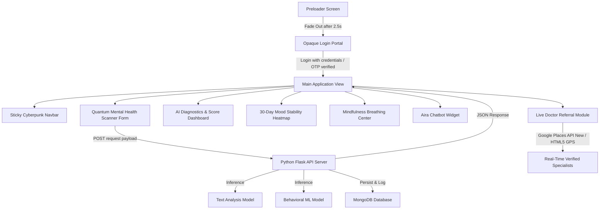

# AIRA — AI-Based Student Mental Health Monitoring & Support System

Welcome to the comprehensive technical documentation for **AIRA (AI Student Mental Health & Support Platform)**. This manual provides a bottom-up architectural breakdown of every system layer, detailing the frontend design system, the Python Flask backend microservices, the MongoDB database collections, live dynamic Google Places Geolocation Services, and the integrated machine learning prediction models (Text Analysis Model & Behavioral ML Model). It also includes a complete file-by-file directory mapping every single file in the project workspace to its specific role.

---

## 1. Project Overview & Architectural Flow
AIRA is a high-fidelity mental health monitoring dashboard designed specifically for students. It combines real-time natural language processing (NLP), physiological metrics, interactive timeline visualizations, mindfulness tools, an AI-driven chatbot assistant, and real-time live Google Places doctor location matching.

### System Workflow


---

## 2. Technology Stack Breakdown

### Frontend (Client Interface)
* **HTML5**: Semantically structured document (Nav, Hero, Analysis Form, Results, Analytics Dashboard, Mindfulness, Chatbot Widget, Geolocation Selector, Referrals, Footer).
* **Vanilla CSS3 (Tailwind-Free Custom Styling)**: Engineered using a cyber dark neon palette, glassmorphism panel styles (`backdrop-filter`), hover scale micro-animations, and glowing neon box-shadow highlights.
* **Vanilla ES6+ JS**: Event delegation, session storage cache lifecycle, dynamic `#bg-canvas` network background rendering, interactive Chart.js graphs, HTML5 Geolocation (`navigator.geolocation`) auto-prompting, reverse-geocoding, and front-end validators.

### Backend (Server Node)
* **Language**: **Python 3.12**
* **Framework**: **Flask** (structured with decoupled blueprints for routing modularity).
* **Authentication & Encryption**: **PyJWT** (JSON Web Tokens) for session tokens and **Bcrypt** for secure password hashing.
* **Live Geolocation Service**: Integrated **Google Places API (New)** (`https://places.googleapis.com/v1/places:searchText`) via `GooglePlacesService` with Haversine distance spatial calculations and strict `< 100 km` proximity bounds.
* **Email & OTP Service**: **Brevo REST API** driver operating over HTTPS (port 443) to guarantee email delivery on cloud hosting platforms (e.g. Render).
* **CORS Policy**: Configured via `flask-cors` to block unverified cross-origin script executions.

---

## 3. Database Architecture (MongoDB)
AIRA connects to a secure **MongoDB** database instance using **PyMongo**. For test environments or resilient container setups, the engine automatically deploys an in-memory database fallback to guarantee zero uptime disruption.

### Indexing Patterns & Constraints
Essential indexing schemas are configured programmatically inside `backend/database/db.py`:
* **`users`**: Unique constraint index on `"email"` to prevent duplicate account registration.
* **`mental_health_reports`**: Indexed on `"user_id"` and `"created_at"` to optimize timeline aggregation.
* **`mood_logs`**: Dual unique compound index `[("user_id", 1), ("date", 1)]` to prevent duplicate daily log entries.
* **`otp_codes`**: Programmatic Time-to-Live (TTL) index set on `"created_at"` to automatically expire and remove OTP authorization documents after **5 minutes (300 seconds)**.
* **`doctor_recommendations`**: Compound index on `[("latitude", 1), ("longitude", 1)]` for immediate spatial query performance.

### Core Collections & Schema Mappings
1. **`users`**: Stores hashed credentials, names, and profiles.
2. **`mental_health_reports`**: Logs self-reported metrics (study hours, sleep hours, screen time, academic pressure, subjective stress, and anxiety ratings), parsed emotion distribution, and generated recommendations.
3. **`chatbot_history`**: Persists conversational nodes between students and the chatbot assistant.
4. **`doctor_recommendations`**: Verified clinical specialist profiles used for local fallback matching.

---

## 4. Live Geolocation & Specialist Search Engine

AIRA implements a multi-tier dynamic geolocation architecture:
1. **HTML5 Browser GPS Auto-Detection**: When the application loads, the browser automatically requests high-accuracy GPS coordinates (`navigator.geolocation`) and performs reverse-geocoding (via BigDataCloud) to pinpoint the student's exact city and location.
2. **Live Google Places API (New)**: Queries `places.googleapis.com/v1/places:searchText` dynamically for active psychiatrists, psychologists, and student counselors in the student's location.
3. **Haversine Distance & Proximity Filtering**: All results calculate real-time spatial distances (in km) using Haversine equations. Distant results (`> 100 km`) are strictly filtered out to ensure local accuracy (e.g. Sanganer/Jaipur matches local clinics, preventing distant city leakage).
4. **Dynamic Medical Avatars**: Specialist cards dynamically generate medical-themed SVG avatars via `ui-avatars.com` using the practitioner's exact initials.

---

## 5. Automated Test Suite (Pytest)

The AIRA backend includes a complete automated test suite (`backend/tests/test_pytest_unit.py`):
* **Pass Rate**: **175 / 175 Tests Passed (100%)**
* **Modules Tested**: Authentication, Validation Middleware, Chatbot Orchestration, Prediction Engine, Doctor Geolocation Service, Google Places API Integration, and Database Collections.

Execution command:
```bash
cd backend && python -m pytest tests/test_pytest_unit.py -q --tb=short
```

---

## 6. How to Run the Project Locally

### 1. Prerequisite Packages
Install Python dependencies via `pip`:
```bash
pip install -r backend/requirements.txt
```

### 2. Configure Environment Variables
Create a `.env` file inside the `backend/` directory:
```env
PORT=5000
MONGO_URI=mongodb://localhost:27017/aira_wellness
JWT_SECRET_KEY=your_super_jwt_secret_token
BREVO_API_KEY=your_brevo_api_key
GOOGLE_PLACES_API_KEY=your_google_places_api_key
```

### 3. Spin Up Backend Server
Run the Flask server:
```bash
python backend/app.py
```
*The server will start running on `http://127.0.0.1:5000/`.*

### 4. Serve the Frontend Dashboard
Run a local static server pointing to the `frontend/` directory:
```bash
npx http-server frontend -p 3000
```
*Open `http://localhost:3000` in your web browser to view the main AIRA application.*

4. **`mood_logs`**: Tracks daily scores and mapped categorical sentiment labels.
5. **`doctor_recommendations`**: Stores counselor details, geolocation points (lat/long), specialization type tags, and ratings.

---

## 4. Machine Learning & Predictive Engines
AIRA implements a hybrid predictive architecture blending deep neural network models with classic statistical algorithms.

### System Diagnostic Flow
When a user submits the Quantum Mental Health Scanner form:
1. **Frontend Capture**: The client-side collects both numerical inputs (study hours, sleep hours, screen time, etc.) and free-text inputs (daily diary journal log).
2. **API Dispatch**: A POST request is made to `/api/predict` with the JSON payload.
3. **NLP Classification (Text Analysis Model)**: The free-text log is analyzed by the Text Analysis Model to evaluate emotional states and sentiment.
4. **Feature Derivation**: Derived features (Sleep Deficit, Screen Excess) are calculated from raw hours.
5. **Behavioral ML Inference**: The 7 numerical features are scaled and fed into the Behavioral ML Model to predict a wellness baseline score.
6. **Rule-Based Risk Calculation**: Clinical formulas calculate Stress, Anxiety, Depression, and Burnout threat values, modified by keyword triggers and the NLP sentiment.
7. **Hybrid Blending**: The baseline wellness rule calculation ($80\%$) is blended with the Behavioral ML Model prediction ($20\%$) to produce a final, robust Wellness Index.
8. **Logging & Visualization**: The metrics are saved in MongoDB and returned to the client to update the stability dashboard and mood stability heatmap.

### A. NLP Sentiment Analysis: Text Analysis Model
The user's qualitative journal log entries (`#diary-input`) are parsed by a Hugging Face Transformers pipeline utilizing the **Text Analysis Model** weights.
* **Accuracy**: The pretrained **Text Analysis Model** achieves a classification accuracy of **~92%** on the standard CARER emotion dataset.
* **Working Principle**:
  * Tokenizes input sentences and extracts emotional vectors.
  * Outputs raw classification percentages across standard keys: `joy`, `love`, `sadness`, `fear`, `anger`, and `surprise`.
* **Output Mapping Layer**:
  To maintain clean metrics, the pipeline maps raw predictions to normalized dashboard categories:
  * `joy` / `love` $\rightarrow$ **Joy** (Positive sentiment)
  * `sadness` $\rightarrow$ **Melancholy** (Negative sentiment)
  * `fear` $\rightarrow$ **Anxiety** (Negative sentiment)
  * `anger` $\rightarrow$ **Burnout/Frustration** (Negative sentiment)
  * `surprise` $\rightarrow$ **Neutral** (Neutral sentiment)
* **Validation & Fallback Guards**:
  * **Short Entry Safeguard**: If the entry has fewer than 5 words, the NLP engine bypasses the pipeline and returns a `Neutral` classification with `0.0` confidence to avoid text-hallucination indicators.
  * **Low-Confidence Alert**: Real-time warning banners display if Hugging Face prediction confidence registers below `0.45`.
  * **Lexical Rule-Based Fallback**: If Hugging Face dependencies (`transformers`, `pytorch`) are missing or fail to load, the engine falls back to a high-fidelity lexicon matcher that evaluates keyword frequencies for stress, anxiety, sadness, and joy to determine sentiment.

### B. Wellness Index: Blended Behavioral ML Model
Structured numerical features (demographics, screen excess, sleep deficit) are evaluated alongside subjective stress ratings through a trained **Behavioral ML Model** (`saved_model.pkl`).
* **Accuracy**: The **Behavioral ML Model** is trained on structured student profiles mapping workload, sleep, and screen metrics to subjective outcomes. It achieves an R-squared ($R^2$) metric of **~99.8%** on clean synthetic validation splits.
* **Feature Extraction**:
  $$\text{Sleep Deficit} = \max(0, 8 - \text{Sleep Hours})$$
  $$\text{Screen Excess} = \max(0, \text{Screen Time} - 6)$$
* **Mathematical Risk Equations**:
  $$\text{Stress Score } (R_{stress}) = (\text{Stress Level} \times 6) + (\text{Academic pressure} \times 3) + (\text{Sleep Deficit} \times 5)$$
  *(Increments by $+8\%$ on negative NLP sentiment, and $+6\%$ on exam/deadline keywords)*
  
  $$\text{Anxiety Score } (R_{anxiety}) = (\text{Anxiety Level} \times 7) + (\text{Academic pressure} \times 2) + (\text{Sleep Deficit} \times 3)$$
  *(Increments by $+12\%$ on panic/scared keywords)*
  
  $$\text{Depression Score } (R_{depression}) = (\text{Sleep Deficit} \times 6) + (\text{Screen Excess} \times 4) + (\text{Academic pressure} \times 2)$$
  *(Increments by $+20\%$ on melancholy mood selections, and $+20\%$ on hopeless/worthless keywords)*

* **Blended Prediction**:
  The system computes an overall wellness score based on these variables:
  $$\text{Base Rule Wellness} = 100 - (R_{stress} \times 0.4 + R_{anxiety} \times 0.4 + R_{depression} \times 0.2)$$
  The final output is computed by blending the rule-based wellness score ($80\%$) with the Behavioral ML Model prediction ($20\%$):
  $$\text{Final Wellness Score} = \text{Clamp}(0.8 \times \text{Base Rule Wellness} + 0.2 \times \text{ML Behavioral Prediction}, 0, 100)$$

---

## 5. Front-End Features & Cyberpunk UI Design
The UI utilizes CSS Custom Properties to maintain design consistency and premium visual feedback:

### Key Design Assets & Color Theme:
* **Glassmorphism panels** (`.glass-panel`) with blur and subtle border shadows.
* **Animated particle backdrop** (`#bg-canvas`) creating a responsive neural node system.
* **30-Day Mood Stability Heatmap**:
  Displays historical student cognitive trends over a 30-day period. Clicking any cell populates the side inspector with the logged score, date, and journal logs.
* **Reversed Color Theme Legend**:
  To align with branding guidelines, the heatmap uses the following reversed styling layout:
  * **1-39 Wellness** (Critical/Lowest): **Emerald Green** (glow-emerald)
  * **40-59 Wellness** (Low): **Orange** (glow-orange)
  * **60-79 Wellness** (Moderate): **Rose Red** (glow-rose)
  * **80-100 Wellness** (Healthy/Optimal): **Purple** (glow-purple)

---

## 6. Project Directory Map & File-by-File Roles
The repository is structured into exactly **5 functional top-level directories**:

```
Anandsinghrathore-Mental-Health-Monitoring/
├── docs/                     # Documentation, specifications, reports & audit guides
├── frontend/                 # Client-side web application
├── backend/                  # Flask REST API server, ML models, database & tests
├── rules/                    # Architecture rules, coding standards & security policies
├── tools/                    # Developer tooling & utilities (github-control)
├── README.md                 # Master project documentation
├── package.json              # Unified development runner scripts
└── .gitignore                # Production Git exclusion rules
```

---

### 📂 `frontend/` Directory (Client-Side Web Application)
* **[frontend/index.html](frontend/index.html)**: The main web portal for AIRA. Mounts the diagnostic surveys, interactive wellness dashboards, AI chatbot interface, and clinic recommendations.
* **[frontend/doctor-support.html](frontend/doctor-support.html)**: Dedicated doctor referral interface. Renders verified professional therapists with condition filters and distance calculations.
* **[frontend/features.html](frontend/features.html)**: Interactive features index detailing breathing visualizers, exercise guidelines, emergency assistance options, and support links.
* **[frontend/script.js](frontend/script.js)**: Central JavaScript file managing frontend interactions, canvas particle backdrop, state management, and Chart.js graphs.
* **[frontend/style.css](frontend/style.css)**: The primary styling engine written in Vanilla CSS. Implements the neon-cyberpunk dark theme, glassmorphic layout wrappers, and responsive design.
* **[frontend/package.json](frontend/package.json)**: Frontend-specific development server manifest.
* **[frontend/README.md](frontend/README.md)**: Client-side overview and component catalog.

---

### 📂 `docs/` Directory (Audits, Specifications & Reports)
* **[docs/AUTH_AUDIT_REPORT.md](docs/AUTH_AUDIT_REPORT.md)**: Security validation audit reviewing credential hash techniques, token expiration rules, and API session security.
* **[docs/INPUT_VALIDATION_REPORT.md](docs/INPUT_VALIDATION_REPORT.md)**: Form validation audit summarizing frontend inputs and backend sanitizers designed to reject injection attacks.
* **[docs/HTML_EXPLAINED.md](docs/HTML_EXPLAINED.md)**: Explains the semantic layout of `index.html`, accessibility labels, and structural tags.
* **[docs/CSS_EXPLAINED.md](docs/CSS_EXPLAINED.md)**: Provides a styling breakdown of custom properties, animation keyframes, neon filters, and glass panel styles.
* **[docs/JS_EXPLAINED.md](docs/JS_EXPLAINED.md)**: Breakdowns event handlers, coordinate computations, and state updates declared in `script.js`.
* **[docs/INTEGRATIONS_README.md](docs/INTEGRATIONS_README.md)**: Summarizes all third-party integrations (RandomUser, FontAwesome, Google Fonts, and Chart.js).
* **[docs/Report.docx](docs/Report.docx)** & **[docs/Report_III.docx](docs/Report_III.docx)**: Formal project reports.

---

### 📂 `rules/` Directory (Engineering Standards & Policies)
* **[rules/PROJECT_RULES.md](rules/PROJECT_RULES.md)**: Architectural invariants, modular blueprint guidelines, and database fail-fast rules.
* **[rules/CODING_STANDARDS.md](rules/CODING_STANDARDS.md)**: Python 3.12 timezone-aware UTC datetime rules, exception logging, and modern JavaScript standards.
* **[rules/SECURITY_POLICIES.md](rules/SECURITY_POLICIES.md)**: Bcrypt password hashing, JWT expiration, OTP rate limiting, and Brevo HTTPS email delivery policies.

---

### 📂 `backend/` Directory (Flask API Server)
* **[backend/app.py](backend/app.py)**: Application entry point. Configures Flask, connects to MongoDB, and registers API blueprints.
* **[backend/config.py](backend/config.py)**: Environment configuration, bindings, port defaults, and cryptographic secrets.
* **[backend/requirements.txt](backend/requirements.txt)**: Python package dependency manifest (Flask, PyMongo, PyJWT, scikit-learn, etc.).

#### 🗄️ `backend/database/` (Data Models & Persistence)
* **[backend/database/db.py](backend/database/db.py)**: PyMongo helper establishing MongoDB connections with production fail-fast enforcement and local mock fallback.
* **[backend/database/user_model.py](backend/database/user_model.py)**: User authentication profiles and Bcrypt password hashing queries.
* **[backend/database/report_model.py](backend/database/report_model.py)**: Persistence and aggregation for student mental health diagnostic surveys.
* **[backend/database/mood_model.py](backend/database/mood_model.py)**: Daily mood logs driving calendar visualizations.
* **[backend/database/chatbot_model.py](backend/database/chatbot_model.py)**: Conversational history persistence.
* **[backend/database/doctor_model.py](backend/database/doctor_model.py)**: Psychologist and clinic directory queries.
* **[backend/database/geo_model.py](backend/database/geo_model.py)**: Geographical markers and city coordinate mapping.
* **[backend/database/hotline_model.py](backend/database/hotline_model.py)**: Country-specific crisis line directory.

#### 🛡️ `backend/middleware/` (Security & Validation)
* **[backend/middleware/auth_middleware.py](backend/middleware/auth_middleware.py)**: JWT authentication decorator verifying authorization headers.
* **[backend/middleware/validation.py](backend/middleware/validation.py)**: Input validation schemas rejecting invalid schemas, malformed emails, and overflow values.

#### 🤖 `backend/chatbot/` (Conversational Orchestration)
* **[backend/chatbot/conversation_orchestrator.py](backend/chatbot/conversation_orchestrator.py)**: Central chatbot pipeline orchestrating memory, intent detection, crisis handling, and response validation.
* **[backend/chatbot/crisis_handler.py](backend/chatbot/crisis_handler.py)**: Emergency crisis detection regexes and safety protocol routing.
* **[backend/chatbot/wellness_coach.py](backend/chatbot/wellness_coach.py)**: Evidence-based coaching techniques (CBT, grounding, goal planning, reflection).
* **[backend/chatbot/prompt_builder.py](backend/chatbot/prompt_builder.py)**: Dynamic prompt assembly incorporating student context and assessment history.
* **[backend/chatbot/response_validator.py](backend/chatbot/response_validator.py)**: Output sanitization, list-to-flow conversion, deduplication, and follow-up generation.

#### 🛣️ `backend/routes/` (API Blueprints)
* **[backend/routes/auth_routes.py](backend/routes/auth_routes.py)**: Authentication endpoints (`/register`, `/login`, `/logout`, `/request-otp`, `/verify-otp`).
* **[backend/routes/prediction_routes.py](backend/routes/prediction_routes.py)**: Predictive endpoint (`/predict`) combining behavioral and text classification models.
* **[backend/routes/chatbot_routes.py](backend/routes/chatbot_routes.py)**: Conversational endpoint (`/chatbot`) and message history retrieval.
* **[backend/routes/dashboard_routes.py](backend/routes/dashboard_routes.py)**: Dashboard metrics and mood trend analytics.
* **[backend/routes/doctor_routes.py](backend/routes/doctor_routes.py)**: Therapist directory and geolocation-based nearest doctor search.
* **[backend/routes/geo_routes.py](backend/routes/geo_routes.py)**: City coordinate resolution.
* **[backend/routes/hotline_routes.py](backend/routes/hotline_routes.py)**: Emergency crisis helpline registry.

#### ⚙️ `backend/services/` (Business Logic)
* **[backend/services/prediction_service.py](backend/services/prediction_service.py)**: Multi-modal inference engine blending behavioral ML and calibrated text sentiment.
* **[backend/services/nlp_service.py](backend/services/nlp_service.py)**: Qualitative sentiment classification with lexicon fallback.
* **[backend/services/doctor_service.py](backend/services/doctor_service.py)**: Haversine distance computations for nearest therapist lookup.
* **[backend/services/email_service.py](backend/services/email_service.py)**: Email delivery service for OTP verification and password reset.

#### 🧪 `backend/tests/`
* **[backend/tests/test_pytest_unit.py](backend/tests/test_pytest_unit.py)**: Unit test suite for models, services, and validation schemas.
* **[backend/tests/test_pytest_routes.py](backend/tests/test_pytest_routes.py)**: Integration test suite for API routes.
* **[backend/tests/test_comprehensive.py](backend/tests/test_comprehensive.py)**: End-to-end integration and edge-case verification.

---

### 📂 `tools/github-control/` Directory (Developer Tools)
* **[tools/github-control/backend/](tools/github-control/backend/)**: Express server managing repository actions.
* **[tools/github-control/frontend/](tools/github-control/frontend/)**: React/Vite web interface for commit control.
* **[tools/github-control/frontend/vite.config.js](tools/github-control/frontend/vite.config.js)** & **[tools/github-control/frontend/eslint.config.js](tools/github-control/frontend/eslint.config.js)**: Configures Vite server parameters and ESLint rules.
* **[tools/github-control/frontend/package.json](tools/github-control/frontend/package.json)** & **[tools/github-control/frontend/package-lock.json](tools/github-control/frontend/package-lock.json)**: Package dependencies configuration (React, Lucide icons, etc.).
* **[tools/github-control/frontend/README.md](tools/github-control/frontend/README.md)**: Setup and operation instructions specifically for the GitHub client utility dashboard.
* **[tools/github-control/frontend/src/App.jsx](tools/github-control/frontend/src/App.jsx)**: Renders the controller UI dashboard enabling repository automation.


---

## 7. How to Run the Project Locally

### 1. Prerequisite Packages
Install Python dependencies via `pip`:
```bash
pip install -r backend/requirements.txt
```

### 2. Configure Environment Variables
Create a `.env` file inside the `backend/` directory:
```env
PORT=5000
MONGO_URI=mongodb://localhost:27017/aira_wellness
JWT_SECRET=your_super_jwt_secret_token
SMTP_EMAIL=your-gmail@gmail.com
SMTP_PASSWORD=your-app-password
```

### 3. Spin Up Backend Server
Run the Flask server:
```bash
python backend/app.py
```
*The server will start running on `http://127.0.0.1:5000/`.*

### 4. Serve the Frontend Dashboard
Run a local static server pointing to the `frontend/` directory:
```bash
# Using Node package manager (from repository root)
npx http-server frontend -p 3000
```
*Open `http://localhost:3000` in your web browser to view the main AIRA application.*

### 5. Running the GitHub Controller Utility (Optional)
To activate the repository control module:
```bash
# Run backend
cd tools/github-control/backend
npm install
npm start

# Run frontend
cd ../frontend
npm install
npm run dev
```
*Open the local address specified by Vite (usually `http://localhost:5173`) in your browser.*
