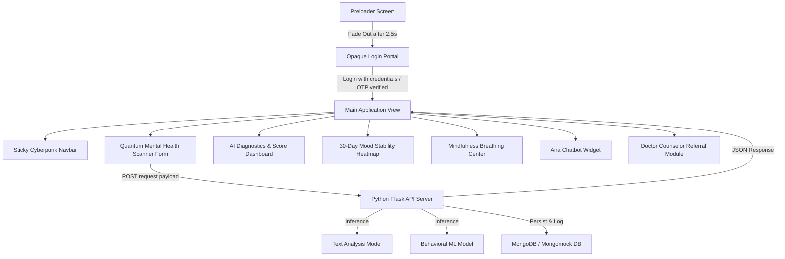

# AIRA — AI-Based Student Mental Health Monitoring & Support System

Welcome to the comprehensive technical documentation for **AIRA (AI Student Mental Health & Support Platform)**. This manual provides a bottom-up architectural breakdown of every system layer, detailing the frontend design system, the Python Flask backend microservices, the MongoDB database collections, and the integrated machine learning prediction models (Text Analysis Model & Behavioral ML Model). It also includes a complete file-by-file directory mapping every single file in the project workspace to its specific role.

---

## 1. Project Overview & Architectural Flow
AIRA is a high-fidelity mental health monitoring dashboard designed specifically for students. It combines real-time natural language processing (NLP), physiological metrics, interactive timeline visualizations, mindfulness tools, and an AI-driven chatbot assistant.

### System Workflow


---

## 2. Technology Stack Breakdown

### Frontend (Client Interface)
* **HTML5**: Semantically structured document (Nav, Hero, Analysis Form, Results, Analytics Dashboard, Mindfulness, Chatbot Widget, Referrals, Footer).
* **Vanilla CSS3 (Tailwind-Free Custom Styling)**: Engineered using a cyber dark neon palette, glassmorphism panel styles (`backdrop-filter`), hover scale micro-animations, and glowing neon box-shadow highlights.
* **Vanilla ES6+ JS**: Event delegation, session storage cache lifecycle, dynamic `#bg-canvas` network background rendering, interactive Chart.js graphs, and front-end validators.

### Backend (Server Node)
* **Language**: **Python 3.12**
* **Framework**: **Flask** (structured with decoupled blueprints for routing modularity).
* **Authentication & Encryption**: **PyJWT** (JSON Web Tokens) for session tokens and **Bcrypt** for secure password hashing.
* **CORS Policy**: Configured via `flask-cors` to block unverified cross-origin script executions.

---

## 3. Database Architecture (MongoDB)
AIRA connects to a secure **MongoDB** database instance using **PyMongo**. For test environments or resilient container setups, the engine automatically deploys a **MongoMock** in-memory database fallback to guarantee zero uptime disruption.

### Indexing Patterns & Constraints
Essential indexing schemas are configured programmatically inside `backend/database/db.py`:
* **`users`**: Unique constraint index on `"email"` to prevent duplicate account registration.
* **`mental_health_reports`**: Indexed on `"user_id"` and `"created_at"` to optimize timeline aggregation.
* **`mood_logs`**: Dual unique compound index `[("user_id", 1), ("date", 1)]` to prevent duplicate daily log entries.
* **`otp_codes`**: Programmatic Time-to-Live (TTL) index set on `"created_at"` to automatically expire and remove OTP authorization documents after **5 minutes (300 seconds)**.
* **`doctor_recommendations`**: Compound index on `[("latitude", 1), ("longitude", 1)]` for immediate spatial query performance.

### Core Collections & Schema Mappings
1. **`users`**: Stores hashed credentials, names, and profiles.
2. **`mental_health_reports`**: Logs self-reported metrics (study hours, sleep hours, screen time, academic pressure, subjective stress, and anxiety ratings), parsed emotion distribution, and generated recommendations.
3. **`chatbot_history`**: Persists conversational nodes between students and the chatbot assistant.
4. **`mood_logs`**: Tracks daily scores and mapped categorical sentiment labels.
5. **`doctor_recommendations`**: Stores counselor details, geolocation points (lat/long), specialization type tags, and ratings.

---

## 4. Machine Learning & Predictive Engines
AIRA implements a hybrid predictive architecture blending deep neural network models with classic statistical algorithms.

### System Diagnostic Flow
When a user submits the Quantum Mental Health Scanner form:
1. **Frontend Capture**: The client-side collects both numerical inputs (study hours, sleep hours, screen time, etc.) and free-text inputs (daily diary journal log).
2. **API Dispatch**: A POST request is made to `/api/predict` with the JSON payload.
3. **NLP Classification (Text Analysis Model)**: The free-text log is analyzed by the Text Analysis Model to evaluate emotional states and sentiment.
4. **Feature Derivation**: Derived features (Sleep Deficit, Screen Excess) are calculated from raw hours.
5. **Behavioral ML Inference**: The 7 numerical features are scaled and fed into the Behavioral ML Model to predict a wellness baseline score.
6. **Rule-Based Risk Calculation**: Clinical formulas calculate Stress, Anxiety, Depression, and Burnout threat values, modified by keyword triggers and the NLP sentiment.
7. **Hybrid Blending**: The baseline wellness rule calculation ($80\%$) is blended with the Behavioral ML Model prediction ($20\%$) to produce a final, robust Wellness Index.
8. **Logging & Visualization**: The metrics are saved in MongoDB and returned to the client to update the stability dashboard and mood stability heatmap.

### A. NLP Sentiment Analysis: Text Analysis Model
The user's qualitative journal log entries (`#diary-input`) are parsed by a Hugging Face Transformers pipeline utilizing the **Text Analysis Model** weights.
* **Accuracy**: The pretrained **Text Analysis Model** achieves a classification accuracy of **~92%** on the standard CARER emotion dataset.
* **Working Principle**:
  * Tokenizes input sentences and extracts emotional vectors.
  * Outputs raw classification percentages across standard keys: `joy`, `love`, `sadness`, `fear`, `anger`, and `surprise`.
* **Output Mapping Layer**:
  To maintain clean metrics, the pipeline maps raw predictions to normalized dashboard categories:
  * `joy` / `love` $\rightarrow$ **Joy** (Positive sentiment)
  * `sadness` $\rightarrow$ **Melancholy** (Negative sentiment)
  * `fear` $\rightarrow$ **Anxiety** (Negative sentiment)
  * `anger` $\rightarrow$ **Burnout/Frustration** (Negative sentiment)
  * `surprise` $\rightarrow$ **Neutral** (Neutral sentiment)
* **Validation & Fallback Guards**:
  * **Short Entry Safeguard**: If the entry has fewer than 5 words, the NLP engine bypasses the pipeline and returns a `Neutral` classification with `0.0` confidence to avoid text-hallucination indicators.
  * **Low-Confidence Alert**: Real-time warning banners display if Hugging Face prediction confidence registers below `0.45`.
  * **Lexical Rule-Based Fallback**: If Hugging Face dependencies (`transformers`, `pytorch`) are missing or fail to load, the engine falls back to a high-fidelity lexicon matcher that evaluates keyword frequencies for stress, anxiety, sadness, and joy to determine sentiment.

### B. Wellness Index: Blended Behavioral ML Model
Structured numerical features (demographics, screen excess, sleep deficit) are evaluated alongside subjective stress ratings through a trained **Behavioral ML Model** (`saved_model.pkl`).
* **Accuracy**: The **Behavioral ML Model** is trained on structured student profiles mapping workload, sleep, and screen metrics to subjective outcomes. It achieves an R-squared ($R^2$) metric of **~99.8%** on clean synthetic validation splits.
* **Feature Extraction**:
  $$\text{Sleep Deficit} = \max(0, 8 - \text{Sleep Hours})$$
  $$\text{Screen Excess} = \max(0, \text{Screen Time} - 6)$$
* **Mathematical Risk Equations**:
  $$\text{Stress Score } (R_{stress}) = (\text{Stress Level} \times 6) + (\text{Academic pressure} \times 3) + (\text{Sleep Deficit} \times 5)$$
  *(Increments by $+8\%$ on negative NLP sentiment, and $+6\%$ on exam/deadline keywords)*
  
  $$\text{Anxiety Score } (R_{anxiety}) = (\text{Anxiety Level} \times 7) + (\text{Academic pressure} \times 2) + (\text{Sleep Deficit} \times 3)$$
  *(Increments by $+12\%$ on panic/scared keywords)*
  
  $$\text{Depression Score } (R_{depression}) = (\text{Sleep Deficit} \times 6) + (\text{Screen Excess} \times 4) + (\text{Academic pressure} \times 2)$$
  *(Increments by $+20\%$ on melancholy mood selections, and $+20\%$ on hopeless/worthless keywords)*

* **Blended Prediction**:
  The system computes an overall wellness score based on these variables:
  $$\text{Base Rule Wellness} = 100 - (R_{stress} \times 0.4 + R_{anxiety} \times 0.4 + R_{depression} \times 0.2)$$
  The final output is computed by blending the rule-based wellness score ($80\%$) with the Behavioral ML Model prediction ($20\%$):
  $$\text{Final Wellness Score} = \text{Clamp}(0.8 \times \text{Base Rule Wellness} + 0.2 \times \text{ML Behavioral Prediction}, 0, 100)$$

---

## 5. Front-End Features & Cyberpunk UI Design
The UI utilizes CSS Custom Properties to maintain design consistency and premium visual feedback:

### Key Design Assets & Color Theme:
* **Glassmorphism panels** (`.glass-panel`) with blur and subtle border shadows.
* **Animated particle backdrop** (`#bg-canvas`) creating a responsive neural node system.
* **30-Day Mood Stability Heatmap**:
  Displays historical student cognitive trends over a 30-day period. Clicking any cell populates the side inspector with the logged score, date, and journal logs.
* **Reversed Color Theme Legend**:
  To align with branding guidelines, the heatmap uses the following reversed styling layout:
  * **1-39 Wellness** (Critical/Lowest): **Emerald Green** (glow-emerald)
  * **40-59 Wellness** (Low): **Orange** (glow-orange)
  * **60-79 Wellness** (Moderate): **Rose Red** (glow-rose)
  * **80-100 Wellness** (Healthy/Optimal): **Purple** (glow-purple)

---

## 6. Project Directory Map & File-by-File Roles
Below is the comprehensive listing of every folder and source code file in this repository with their exact technical roles:

### 📂 Root Directory (Frontend & Base System)
* **[index.html](file:///c:/Users/ajays/OneDrive/Desktop/Social%20Media%20Mental%20Health%20Risk%20Analyzer%E2%80%9D/index.html)**: The main, primary web portal for AIRA. It mounts the preloader system, authenticating structures (registration, credential logins, email verification), clinical diagnostic surveys, interactive wellness dashboards, AI chatbot windows, and clinic recommendations.
* **[doctor-support.html](file:///c:/Users/ajays/OneDrive/Desktop/Social%20Media%20Mental%20Health%20Risk%20Analyzer%E2%80%9D/doctor-support.html)**: Dedicated doctor referral interface. Renders verified professional therapists, allows users to filter by condition, and dynamically computes distances based on browser geolocation APIs.
* **[features.html](file:///c:/Users/ajays/OneDrive/Desktop/Social%20Media%20Mental%20Health%20Risk%20Analyzer%E2%80%9D/features.html)**: Interactive features index detailing breathing visualizers, exercise guidelines, emergency assistance options, and general support links.
* **[script.js](file:///c:/Users/ajays/OneDrive/Desktop/Social%20Media%20Mental%20Health%20Risk%20Analyzer%E2%80%9D/script.js)**: Central Javascript file managing frontend interactions. Handles custom canvas particle backdrops, input formatting/validation, state storage management (using `sessionStorage` and in-memory variables), ChartJS line/radar graphing setups, and fallback API calculations.
* **[style.css](file:///c:/Users/ajays/OneDrive/Desktop/Social%20Media%20Mental%20Health%20Risk%20Analyzer%E2%80%9D/style.css)**: The primary styling engine written in Vanilla CSS. Implements the neon-cyberpunk dark theme, glassmorphic layout wrappers, floating input outlines, breathing micro-animations, and responsive layouts.
* **[gunicorn.conf.py](file:///c:/Users/ajays/OneDrive/Desktop/Social%20Media%20Mental%20Health%20Risk%20Analyzer%E2%80%9D/gunicorn.conf.py)**: Web server configuration used to run the production build of the Python Flask application.
* **[package.json](file:///c:/Users/ajays/OneDrive/Desktop/Social%20Media%20Mental%20Health%20Risk%20Analyzer%E2%80%9D/package.json)**: Node.js packages manifest primarily tracking tooling resources for frontend server utilities.
* **[.gitignore](file:///c:/Users/ajays/OneDrive/Desktop/Social%20Media%20Mental%20Health%20Risk%20Analyzer%E2%80%9D/.gitignore)**: Enforces Git version exclusions for cache files (`.pyc`, `__pycache__`), local databases, build files, packages, and environment settings.
* **[.python-version](file:///c:/Users/ajays/OneDrive/Desktop/Social%20Media%20Mental%20Health%20Risk%20Analyzer%E2%80%9D/.python-version)**: Specifies the local system python runtime configuration constraints.

#### 📄 Audits & Guides
* **[AUTH_AUDIT_REPORT.md](file:///c:/Users/ajays/OneDrive/Desktop/Social%20Media%20Mental%20Health%20Risk%20Analyzer%E2%80%9D/AUTH_AUDIT_REPORT.md)**: Security validation audit reviewing credential hash techniques, token expiration rules, and API session security.
* **[INPUT_VALIDATION_REPORT.md](file:///c:/Users/ajays/OneDrive/Desktop/Social%20Media%20Mental%20Health%20Risk%20Analyzer%E2%80%9D/INPUT_VALIDATION_REPORT.md)**: Form validation audit summarizing frontend inputs and backend sanitizers designed to reject XSS injection strings and spam.
* **[HTML_EXPLAINED.md](file:///c:/Users/ajays/OneDrive/Desktop/Social%20Media%20Mental%20Health%20Risk%20Analyzer%E2%80%9D/HTML_EXPLAINED.md)**: Explains the semantic layout of `index.html`, outlines accessibility labels, structural tags, and canvas nodes.
* **[CSS_EXPLAINED.md](file:///c:/Users/ajays/OneDrive/Desktop/Social%20Media%20Mental%20Health%20Risk%20Analyzer%E2%80%9D/CSS_EXPLAINED.md)**: Provides a styling breakdown of custom properties, animation keyframes, neon filters, and structural glass panel classes.
* **[JS_EXPLAINED.md](file:///c:/Users/ajays/OneDrive/Desktop/Social%20Media%20Mental%20Health%20Risk%20Analyzer%E2%80%9D/JS_EXPLAINED.md)**: Breakdowns event handlers, coordinate computations, and state updates declared in `script.js`.
* **[INTEGRATIONS_README.md](file:///c:/Users/ajays/OneDrive/Desktop/Social%20Media%20Mental%20Health%20Risk%20Analyzer%E2%80%9D/INTEGRATIONS_README.md)**: Summarizes all third-party integrations (RandomUser, UI-Avatars, FontAwesome, Google Fonts, and ChartJS) along with their APIs.

---

### 📂 `backend/` Directory (Flask API Server)
* **[backend/app.py](file:///c:/Users/ajays/OneDrive/Desktop/Social%20Media%20Mental%20Health%20Risk%20Analyzer%E2%80%9D/backend/app.py)**: The entry point of the Python Flask backend app. Initializes configurations, enables CORS, connects and seeds the MongoDB database collections, and registers blueprinted endpoints.
* **[backend/config.py](file:///c:/Users/ajays/OneDrive/Desktop/Social%20Media%20Mental%20Health%20Risk%20Analyzer%E2%80%9D/backend/config.py)**: Maps server environment configurations, bindings, port defaults, and cryptographic secrets.
* **[backend/requirements.txt](file:///c:/Users/ajays/OneDrive/Desktop/Social%20Media%20Mental%20Health%20Risk%20Analyzer%E2%80%9D/backend/requirements.txt)**: Python package dependency manifest (Flask, PyMongo, PyJWT, Bcrypt, transformers, etc.).
* **[backend/scratch_check_model.py](file:///c:/Users/ajays/OneDrive/Desktop/Social%20Media%20Mental%20Health%20Risk%20Analyzer%E2%80%9D/backend/scratch_check_model.py)**: Independent developer script to test the ML models and NLP tokenizers directly on local setups.
* **[backend/.env](file:///c:/Users/ajays/OneDrive/Desktop/Social%20Media%20Mental%20Health%20Risk%20Analyzer%E2%80%9D/backend/.env)**: Holds system-specific keys, MongoDB URIs, and Brevo API details.

#### 🗄️ `backend/database/` (Data Schemas & Seeding)
* **[db.py](file:///c:/Users/ajays/OneDrive/Desktop/Social%20Media%20Mental%20Health%20Risk%20Analyzer%E2%80%9D/backend/database/db.py)**: PyMongo helper file that establishes MongoDB connections. Implements index configurations (TTL indexes, unique indexes) and manages MongoMock fallback environments.
* **[user_model.py](file:///c:/Users/ajays/OneDrive/Desktop/Social%20Media%20Mental%20Health%20Risk%20Analyzer%E2%80%9D/backend/database/user_model.py)**: Handles queries for registered user profiles and checks Bcrypt password hashes.
* **[report_model.py](file:///c:/Users/ajays/OneDrive/Desktop/Social%20Media%20Mental%20Health%20Risk%20Analyzer%E2%80%9D/backend/database/report_model.py)**: Methods for saving, editing, and aggregating student mental health diagnostic surveys.
* **[mood_model.py](file:///c:/Users/ajays/OneDrive/Desktop/Social%20Media%20Mental%20Health%20Risk%20Analyzer%E2%80%9D/backend/database/mood_model.py)**: Database schema representing daily Mood logs to drive the calendar tracking visualizers.
* **[chatbot_model.py](file:///c:/Users/ajays/OneDrive/Desktop/Social%20Media%20Mental%20Health%20Risk%20Analyzer%E2%80%9D/backend/database/chatbot_model.py)**: Database methods persisting student conversations with the chatbot.
* **[doctor_model.py](file:///c:/Users/ajays/OneDrive/Desktop/Social%20Media%20Mental%20Health%20Risk%20Analyzer%E2%80%9D/backend/database/doctor_model.py)**: Handles database queries for finding professional psychologists and clinics.
* **[geo_model.py](file:///c:/Users/ajays/OneDrive/Desktop/Social%20Media%20Mental%20Health%20Risk%20Analyzer%E2%80%9D/backend/database/geo_model.py)**: Database mapping logic for local cities and coordinates.
* **[hotline_model.py](file:///c:/Users/ajays/OneDrive/Desktop/Social%20Media%20Mental%20Health%20Risk%20Analyzer%E2%80%9D/backend/database/hotline_model.py)**: Manages listings for active medical lines.
* **[import_geo_data.py](file:///c:/Users/ajays/OneDrive/Desktop/Social%20Media%20Mental%20Health%20Risk%20Analyzer%E2%80%9D/backend/database/import_geo_data.py)**: Helper command-line loader utility that imports geographical markers and city information.
* **[import_hotlines.py](file:///c:/Users/ajays/OneDrive/Desktop/Social%20Media%20Mental%20Health%20Risk%20Analyzer%E2%80%9D/backend/database/import_hotlines.py)**: CLI script imports crisis lines from `mental_health_hotlines.json` into MongoDB.
* **[mental_health_hotlines.json](file:///c:/Users/ajays/OneDrive/Desktop/Social%20Media%20Mental%20Health%20Risk%20Analyzer%E2%80%9D/backend/database/mental_health_hotlines.json)**: Raw JSON source list containing emergency hotlines categorized by country and region.

#### 🛡️ `backend/middleware/` (Interceptors)
* **[auth_middleware.py](file:///c:/Users/ajays/OneDrive/Desktop/Social%20Media%20Mental%20Health%20Risk%20Analyzer%E2%80%9D/backend/middleware/auth_middleware.py)**: Request decorator verifying client-sent Authorization JWT headers. Intercepts private operations and sets request context context values.
* **[validation.py](file:///c:/Users/ajays/OneDrive/Desktop/Social%20Media%20Mental%20Health%20Risk%20Analyzer%E2%80%9D/backend/middleware/validation.py)**: Server-side validation schema ensuring input compliance (rejecting SQL, invalid emails, empty structures, and numeric overflows).

#### 🧬 `backend/ml/` & `backend/nlp/` (Predictive Engine Internals)
* **[preprocess.py](file:///c:/Users/ajays/OneDrive/Desktop/Social%20Media%20Mental%20Health%20Risk%20Analyzer%E2%80%9D/backend/ml/preprocess.py)**: Translates user-submitted surveys to scaled parameters, calculates derived stats like sleep deficit and screen excess, and feeds the outputs to predicting libraries.
* **[train_model.py](file:///c:/Users/ajays/OneDrive/Desktop/Social%20Media%20Mental%20Health%20Risk%20Analyzer%E2%80%9D/backend/ml/train_model.py)**: Backup training orchestrator script for the behavioral model.
* **[distilbert.py](file:///c:/Users/ajays/OneDrive/Desktop/Social%20Media%20Mental%20Health%20Risk%20Analyzer%E2%80%9D/backend/nlp/distilbert.py)**: Interacts with the DistilBert transformer network to run sentiment predictions. Implements a dictionary-based fallback parser if packages are missing.
* **[gibberish_detector.py](file:///c:/Users/ajays/OneDrive/Desktop/Social%20Media%20Mental%20Health%20Risk%20Analyzer%E2%80%9D/backend/nlp/gibberish_detector.py)**: Custom analyzer detecting meaningless text entries (e.g. "asdfghjk") to block invalid logging inputs.

#### 🛣️ `backend/routes/` (Flask Blueprints)
* **[auth_routes.py](file:///c:/Users/ajays/OneDrive/Desktop/Social%20Media%20Mental%20Health%20Risk%20Analyzer%E2%80%9D/backend/routes/auth_routes.py)**: Blueprint exposing endpoints for `/register`, `/login`, `/logout`, `/request-otp`, and `/verify-otp`.
* **[prediction_routes.py](file:///c:/Users/ajays/OneDrive/Desktop/Social%20Media%20Mental%20Health%20Risk%20Analyzer%E2%80%9D/backend/routes/prediction_routes.py)**: Maps the `/predict` POST request to execute the hybrid AI diagnostic model (combining behavioral regression and text classifiers).
* **[chatbot_routes.py](file:///c:/Users/ajays/OneDrive/Desktop/Social%20Media%20Mental%20Health%20Risk%20Analyzer%E2%80%9D/backend/routes/chatbot_routes.py)**: Blueprint route serving `/chatbot` messages and history retrieval.
* **[dashboard_routes.py](file:///c:/Users/ajays/OneDrive/Desktop/Social%20Media%20Mental%20Health%20Risk%20Analyzer%E2%80%9D/backend/routes/dashboard_routes.py)**: Serves dashboard analytics queries mapping daily mood codes and trend arrays.
* **[doctor_routes.py](file:///c:/Users/ajays/OneDrive/Desktop/Social%20Media%20Mental%20Health%20Risk%20Analyzer%E2%80%9D/backend/routes/doctor_routes.py)**: Exposes endpoints to retrieve psychologist profiles, reviews, and clinical references.
* **[geo_routes.py](file:///c:/Users/ajays/OneDrive/Desktop/Social%20Media%20Mental%20Health%20Risk%20Analyzer%E2%80%9D/backend/routes/geo_routes.py)**: Exposes endpoints for matching and computing nearest clinic details.
* **[hotline_routes.py](file:///c:/Users/ajays/OneDrive/Desktop/Social%20Media%20Mental%20Health%20Risk%20Analyzer%E2%80%9D/backend/routes/hotline_routes.py)**: Serves country-specific emergency help line databases.

#### ⚙️ `backend/services/` (Business Logic)
* **[prediction_service.py](file:///c:/Users/ajays/OneDrive/Desktop/Social%20Media%20Mental%20Health%20Risk%20Analyzer%E2%80%9D/backend/services/prediction_service.py)**: Blends numerical calculations (80%) and NLP inputs (20%) to yield the final Wellness Index.
* **[nlp_service.py](file:///c:/Users/ajays/OneDrive/Desktop/Social%20Media%20Mental%20Health%20Risk%20Analyzer%E2%80%9D/backend/services/nlp_service.py)**: Evaluates qualitative text inputs using DistilBert sentiment classifiers or dictionary keywords.
* **[chatbot_service.py](file:///c:/Users/ajays/OneDrive/Desktop/Social%20Media%20Mental%20Health%20Risk%20Analyzer%E2%80%9D/backend/services/chatbot_service.py)**: Standard conversational script matching user text statements to pre-selected context answers.
* **[dashboard_service.py](file:///c:/Users/ajays/OneDrive/Desktop/Social%20Media%20Mental%20Health%20Risk%20Analyzer%E2%80%9D/backend/services/dashboard_service.py)**: Queries data collections to compile student metrics.
* **[doctor_service.py](file:///c:/Users/ajays/OneDrive/Desktop/Social%20Media%20Mental%20Health%20Risk%20Analyzer%E2%80%9D/backend/services/doctor_service.py)**: Matches users to counselors based on coordinates using the Haversine formula.
* **[email_service.py](file:///c:/Users/ajays/OneDrive/Desktop/Social%20Media%20Mental%20Health%20Risk%20Analyzer%E2%80%9D/backend/services/email_service.py)**: Service class integrating Brevo APIs to dispatch security notifications and authentication OTP numbers.

#### 🧪 `backend/tests/`
* **[test_validation.py](file:///c:/Users/ajays/OneDrive/Desktop/Social%20Media%20Mental%20Health%20Risk%20Analyzer%E2%80%9D/backend/tests/test_validation.py)**: Programmatic Pytest test suite asserting the security and validation requirements of the middleware.

---

### 📂 `ml/` Directory (Machine Learning & Training Workspace)
* **[ml/saved_model.pkl](file:///c:/Users/ajays/OneDrive/Desktop/Social%20Media%20Mental%20Health%20Risk%20Analyzer%E2%80%9D/ml/saved_model.pkl)**: The serialized Behavioral ML predictor.
* **[ml/saved_scaler.pkl](file:///c:/Users/ajays/OneDrive/Desktop/Social%20Media%20Mental%20Health%20Risk%20Analyzer%E2%80%9D/ml/saved_scaler.pkl)**: Serialized Standard Scaler model mapping column dimensions.

#### 📊 Model 1: Behavioral Mental Health Predictor
* **[ml/Model 1 Behavioral Mental Health Predictor/train_models.py](file:///c:/Users/ajays/OneDrive/Desktop/Social%20Media%20Mental%20Health%20Risk%20Analyzer%E2%80%9D/ml/Model%201%20Behavioral%20Mental%20Health%20Predictor/train_models.py)**: Evaluation and comparing script testing various algorithms (Decision Trees, Random Forests, Linear Regression) to select and dump the best model.
* **[ml/Model 1 Behavioral Mental Health Predictor/preprocess.py](file:///c:/Users/ajays/OneDrive/Desktop/Social%20Media%20Mental%20Health%20Risk%20Analyzer%E2%80%9D/ml/Model%201%20Behavioral%20Mental%20Health%20Predictor/preprocess.py)**: Standard columns cleaner and scaler tool.
* **[ml/Model 1 Behavioral Mental Health Predictor/predict.py](file:///c:/Users/ajays/OneDrive/Desktop/Social%20Media%20Mental%20Health%20Risk%20Analyzer%E2%80%9D/ml/Model%201%20Behavioral%20Mental%20Health%20Predictor/predict.py)**: Standalone script validating inference inputs.
* **[ml/Model 1 Behavioral Mental Health Predictor/download_dataset.py](file:///c:/Users/ajays/OneDrive/Desktop/Social%20Media%20Mental%20Health%20Risk%20Analyzer%E2%80%9D/ml/Model%201%20Behavioral%20Mental%20Health%20Predictor/download_dataset.py)**: Programmatic dataset downloader.
* **[ml/Model 1 Behavioral Mental Health Predictor/app.py](file:///c:/Users/ajays/OneDrive/Desktop/Social%20Media%20Mental%20Health%20Risk%20Analyzer%E2%80%9D/ml/Model%201%20Behavioral%20Mental%20Health%20Predictor/app.py)**: Standalone API endpoint wrapper allowing predictions for Model 1 independently.
* **[smmh.csv](file:///c:/Users/ajays/OneDrive/Desktop/Social%20Media%20Mental%20Health%20Risk%20Analyzer%E2%80%9D/ml/Model%201%20Behavioral%20Mental%20Health%20Predictor/smmh.csv)**, **[Student Depression Dataset.csv](file:///c:/Users/ajays/OneDrive/Desktop/Social%20Media%20Mental%20Health%20Risk%20Analyzer%E2%80%9D/ml/Model%201%20Behavioral%20Mental%20Health%20Predictor/Student%20Depression%20Dataset.csv)**, & **[Student Mental health.csv](file:///c:/Users/ajays/OneDrive/Desktop/Social%20Media%20Mental%20Health%20Risk%20Analyzer%E2%80%9D/ml/Model%201%20Behavioral%20Mental%20Health%20Predictor/Student%20Mental%20health.csv)**: Datasets holding training student profiles.

#### 📝 Model 2: Text Mental Health Model
* **[ml/Model 2  Text Mental Health Model/train.py](file:///c:/Users/ajays/OneDrive/Desktop/Social%20Media%20Mental%20Health%20Risk%20Analyzer%E2%80%9D/ml/Model%202%20%20Text%20Mental%20Health%20Model/train.py)**: Fits a TF-IDF classifier combined with Support Vector / Logistic Regression estimators to classify text sentiments.
* **[ml/Model 2  Text Mental Health Model/preprocess.py](file:///c:/Users/ajays/OneDrive/Desktop/Social%20Media%20Mental%20Health%20Risk%20Analyzer%E2%80%9D/ml/Model%202%20%20Text%20Mental%20Health%20Model/preprocess.py)**: Sanitizes input statements by mapping common contractions and formatting words.
* **[ml/Model 2  Text Mental Health Model/text_predict.py](file:///c:/Users/ajays/OneDrive/Desktop/Social%20Media%20Mental%20Health%20Risk%20Analyzer%E2%80%9D/ml/Model%202%20%20Text%20Mental%20Health%20Model/text_predict.py)**: Runs terminal-level sentiment classifications on user-entered test lines.
* **[ml/Model 2  Text Mental Health Model/text_api.py](file:///c:/Users/ajays/OneDrive/Desktop/Social%20Media%20Mental%20Health%20Risk%20Analyzer%E2%80%9D/ml/Model%202%20%20Text%20Mental%20Health%20Model/text_api.py)**: Exposes an independent REST service endpoint returning predictions for text sentiment requests.
* **[ml/Model 2  Text Mental Health Model/set_production_model.py](file:///c:/Users/ajays/OneDrive/Desktop/Social%20Media%20Mental%20Health%20Risk%20Analyzer%E2%80%9D/ml/Model%202%20%20Text%20Mental%20Health%20Model/set_production_model.py)**: Copies serialized vectorizers and model packages to the production server runtime folder.
* **[ml/Model 2  Text Mental Health Model/download_dataset.py](file:///c:/Users/ajays/OneDrive/Desktop/Social%20Media%20Mental%20Health%20Risk%20Analyzer%E2%80%9D/ml/Model%202%20%20Text%20Mental%20Health%20Model/download_dataset.py)**: Downloads sentiment text archives (e.g. CARER data format) for learning.
* **[text_model.pkl](file:///c:/Users/ajays/OneDrive/Desktop/Social%20Media%20Mental%20Health%20Risk%20Analyzer%E2%80%9D/ml/Model%202%20%20Text%20Mental%20Health%20Model/text_model.pkl)** & **[text_vectorizer.pkl](file:///c:/Users/ajays/OneDrive/Desktop/Social%20Media%20Mental%20Health%20Risk%20Analyzer%E2%80%9D/ml/Model%202%20%20Text%20Mental%20Health%20Model/text_vectorizer.pkl)**: Serialized TF-IDF text models used in evaluations.

---

### 📂 `github-control/` Directory (Repo Automation & Commits Management)

#### 🖥️ `github-control/backend/` (Express API)
* **[server.js](file:///c:/Users/ajays/OneDrive/Desktop/Social%20Media%20Mental%20Health%20Risk%20Analyzer%E2%80%9D/github-control/backend/server.js)**: The main entry of the repository controller. Sets up Express, configures routing endpoints, and listens for requests.
* **[routes/github.js](file:///c:/Users/ajays/OneDrive/Desktop/Social%20Media%20Mental%20Health%20Risk%20Analyzer%E2%80%9D/github-control/backend/routes/github.js)**: Manages API communication with GitHub APIs, enabling automatic commits, push requests, and file checks.
* **[middleware/validation.js](file:///c:/Users/ajays/OneDrive/Desktop/Social%20Media%20Mental%20Health%20Risk%20Analyzer%E2%80%9D/github-control/backend/middleware/validation.js)**: Enforces validation schemas on API payloads to keep requests secure.
* **[utils/logger.js](file:///c:/Users/ajays/OneDrive/Desktop/Social%20Media%20Mental%20Health%20Risk%20Analyzer%E2%80%9D/github-control/backend/utils/logger.js)**: Sets up Winston and Morgan logging streams.
* **[logs/audit-actions.log](file:///c:/Users/ajays/OneDrive/Desktop/Social%20Media%20Mental%20Health%20Risk%20Analyzer%E2%80%9D/github-control/backend/logs/audit-actions.log)**: Persistent text file storing logged repository interactions.
* **[package.json](file:///c:/Users/ajays/OneDrive/Desktop/Social%20Media%20Mental%20Health%20Risk%20Analyzer%E2%80%9D/github-control/backend/package.json)** & **[package-lock.json](file:///c:/Users/ajays/OneDrive/Desktop/Social%20Media%20Mental%20Health%20Risk%20Analyzer%E2%80%9D/github-control/backend/package-lock.json)**: Configures and freezes Node packages list (Express, Axios, Winston, etc.).
* **[.env](file:///c:/Users/ajays/OneDrive/Desktop/Social%20Media%20Mental%20Health%20Risk%20Analyzer%E2%80%9D/github-control/backend/.env)** & **[env.template](file:///c:/Users/ajays/OneDrive/Desktop/Social%20Media%20Mental%20Health%20Risk%20Analyzer%E2%80%9D/github-control/backend/env.template)**: Environment configurations and templates for GitHub integration parameters.

#### 💻 `github-control/frontend/` (Vite-React Dashboard)
* **[index.html](file:///c:/Users/ajays/OneDrive/Desktop/Social%20Media%20Mental%20Health%20Risk%20Analyzer%E2%80%9D/github-control/frontend/index.html)**: Main index mount for the React project.
* **[vite.config.js](file:///c:/Users/ajays/OneDrive/Desktop/Social%20Media%20Mental%20Health%20Risk%20Analyzer%E2%80%9D/github-control/frontend/vite.config.js)** & **[eslint.config.js](file:///c:/Users/ajays/OneDrive/Desktop/Social%20Media%20Mental%20Health%20Risk%20Analyzer%E2%80%9D/github-control/frontend/eslint.config.js)**: Configures Vite server parameters and ESLint rules.
* **[package.json](file:///c:/Users/ajays/OneDrive/Desktop/Social%20Media%20Mental%20Health%20Risk%20Analyzer%E2%80%9D/github-control/frontend/package.json)** & **[package-lock.json](file:///c:/Users/ajays/OneDrive/Desktop/Social%20Media%20Mental%20Health%20Risk%20Analyzer%E2%80%9D/github-control/frontend/package-lock.json)**: Package dependencies configuration (React, Lucide icons, etc.).
* **[README.md](file:///c:/Users/ajays/OneDrive/Desktop/Social%20Media%20Mental%20Health%20Risk%20Analyzer%E2%80%9D/github-control/frontend/README.md)**: Setup and operation instructions specifically for the GitHub client utility dashboard.
* **[public/favicon.svg](file:///c:/Users/ajays/OneDrive/Desktop/Social%20Media%20Mental%20Health%20Risk%20Analyzer%E2%80%9D/github-control/frontend/public/favicon.svg)** & **[public/icons.svg](file:///c:/Users/ajays/OneDrive/Desktop/Social%20Media%20Mental%20Health%20Risk%20Analyzer%E2%80%9D/github-control/frontend/public/icons.svg)**: SVG icon resources.
* **[src/main.jsx](file:///c:/Users/ajays/OneDrive/Desktop/Social%20Media%20Mental%20Health%20Risk%20Analyzer%E2%80%9D/github-control/frontend/src/main.jsx)**: Mounts the main React component.
* **[src/App.jsx](file:///c:/Users/ajays/OneDrive/Desktop/Social%20Media%20Mental%20Health%20Risk%20Analyzer%E2%80%9D/github-control/frontend/src/App.jsx)**: Renders the controller UI dashboard enabling users to trigger GitHub commits, fetch push audits, and monitor repository activities.
* **[src/App.css](file:///c:/Users/ajays/OneDrive/Desktop/Social%20Media%20Mental%20Health%20Risk%20Analyzer%E2%80%9D/github-control/frontend/src/App.css)** & **[src/index.css](file:///c:/Users/ajays/OneDrive/Desktop/Social%20Media%20Mental%20Health%20Risk%20Analyzer%E2%80%9D/github-control/frontend/src/index.css)**: Visual styles and sheets for the React app.
* **[src/assets/](file:///c:/Users/ajays/OneDrive/Desktop/Social%20Media%20Mental%20Health%20Risk%20Analyzer%E2%80%9D/github-control/frontend/src/assets/)**: Subdirectory containing base iconographies and illustration files.

---

## 7. How to Run the Project Locally

### 1. Prerequisite Packages
Install Python dependencies via `pip`:
```bash
pip install -r backend/requirements.txt
```

### 2. Configure Environment Variables
Create a `.env` file inside the `backend/` directory:
```env
PORT=5000
MONGO_URI=mongodb://localhost:27017/aira_wellness
JWT_SECRET=your_super_jwt_secret_token
SMTP_EMAIL=your-gmail@gmail.com
SMTP_PASSWORD=your-app-password
```

### 3. Spin Up Backend Server
Run the Flask server:
```bash
python backend/app.py
```
*The server will start running on `http://127.0.0.1:5000/`.*

### 4. Serve the Frontend Dashboard
Run a local static server inside the root directory:
```bash
# Using Node package manager (if available)
npx http-server -p 3000
```
*Open `http://localhost:3000` in your web browser to view the main AIRA application.*

### 5. Running the GitHub Controller Utility (Optional)
To activate the repository control module:
```bash
# Run backend
cd github-control/backend
npm install
npm start

# Run frontend
cd ../frontend
npm install
npm run dev
```
*Open the local address specified by Vite (usually `http://localhost:5173`) in your browser.*
